# THỐNG KÊ MÔ TẢ
```r
options(warn = -1)
# Kiểm tra, cài đặt và load các package cần thiết

packages <- c(
  "MSwM",
  "forecast",
  "readxl",
  "tseries",
  "dplyr",
  "gridExtra",
  "ggplot2",
  "data.table",
  "zoo",
  "tidyverse",
  "moments",
  "rlang",
  "rugarch",
  "FinTS",
  "RColorBrewer",
  "tvReg",
  "reshape2",
  "quantreg",
  "lmtest",
  "nonlinearTseries",
  "scales"
)
install_if_missing <- function(pkg) {
  if (!requireNamespace(pkg, quietly = TRUE)) {
    install.packages(pkg, quiet = TRUE)
  }
}
invisible(sapply(packages, install_if_missing))
invisible(sapply(packages, function(pkg) {
  suppressMessages(suppressWarnings(library(pkg, character.only = TRUE)))
}))

# =========================================================================

# Import và tiền xử lý data
df <- read_excel("~/KLTN/data.xlsx", sheet = "processed")

df <- df %>% arrange(DATE)

df$LNVOL <- log(df$VNINDEX_VOL)

df_clean <- df %>%
  arrange(DATE) %>%
  drop_na()

# =========================================================================

# Thống kê mô tả
desc_stats <- function(x) {
  c(
    Mean = mean(x),
    SD = sd(x),
    Min = min(x),
    Max = max(x),
    Skewness = skewness(x),
    Kurtosis = kurtosis(x),
    "JB p-value" = jarque.bera.test(x)$p.value
  )
}

desc_table <- sapply(df_clean[, c(
  "VNINDEX_R",
  "SP500_R",
  "USDVND_R",
  "BRENT_R",
  "LNVOL",
  "NFI_VOL"
)], desc_stats)
desc_table <- t(round(desc_table, 4))
desc_table
```

```
##                    Mean         SD           Min          Max Skewness Kurtosis JB p-value
## VNINDEX_R        0.0001 1.3700e-02 -6.910000e-02 6.550000e-02  -0.4424   5.4897          0
## SP500_R          0.0003 1.2600e-02 -1.277000e-01 1.096000e-01  -0.4383  15.6121          0
## USDVND_R         0.0001 4.6000e-03 -1.208000e-01 1.219000e-01   0.7518 257.9072          0
## BRENT_R          0.0000 2.3700e-02 -2.798000e-01 3.212000e-01  -0.3306  21.8774          0
## LNVOL           18.6008 1.4529e+00  1.397550e+01 2.140890e+01  -0.4229   2.5759          0
## NFI_VOL   -1072124.6080 1.2835e+07 -2.848878e+08 1.905554e+08  -1.9556  84.2485          0
```

---
```r
# Plot
vars <- c(
  "VNINDEX_R",
  "SP500_R",
  "USDVND_R",
  "BRENT_R",
  "LNVOL",
  "NFI_VOL"
)

## Line plot
p_list <- lapply(vars, function(v) {
  ggplot(df_clean, aes_string(x = "DATE", y = v)) +
    geom_line(color = "palegreen3") +
    labs(x = "Date", y = v) +
    theme_minimal()
})
grid.arrange(grobs = p_list, ncol = 2)
```

***Biểu đồ đường của các biến theo thời gian***  
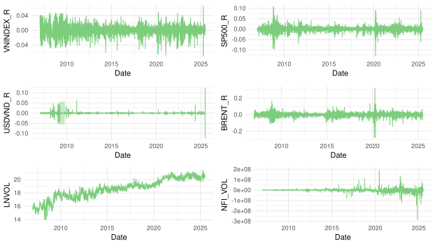

---
```r
## Histogram + Density plot
hist_list <- lapply(vars, function(v) {
  ggplot(df_clean, aes_string(x = v)) +
    geom_histogram(
      aes(y = ..density..),
      bins = 60,
      fill = "palegreen3",
      color = "gray"
    ) +
    geom_density(color = "salmon", linewidth = 1) +
    labs(
      title = paste("Histogram & Density of", v),
      x = v,
      y = "Density"
    ) +
    theme_minimal()
})
grid.arrange(grobs = hist_list, ncol = 2)
```

***Histogram và mật độ kernel của các biến***  
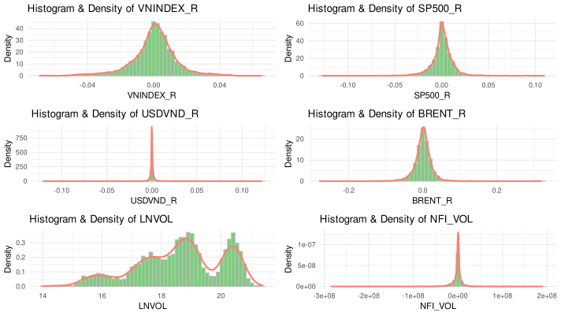

---
```r
## QQ plot
qq_list <- lapply(vars, function(v) {
  ggplot(df_clean, aes(sample = .data[[v]])) +
    stat_qq() +
    stat_qq_line(color = "salmon") +
    labs(
      title = paste("QQ Plot:", v),
      x = "Theoretical Quantiles",
      y = "Sample Quantiles"
    ) +
    theme_minimal()
})
grid.arrange(grobs = qq_list, ncol = 2)
```

***Biểu đồ QQ của các biến***  


---
# MARKOV SWITCHING MODEL
```r
## Kiểm tra tính dừng
adf.test(df_clean$VNINDEX_R, alternative = "stationary")
adf.test(df_clean$SP500_R, alternative = "stationary")
adf.test(df_clean$USDVND_R, alternative = "stationary")
adf.test(df_clean$BRENT_R, alternative = "stationary")
adf.test(df_clean$LNVOL, alternative = "stationary")
adf.test(df_clean$NFI_VOL, alternative = "stationary")

## Kiểm định tuyến tính (Tsay test)
tsay <- tsayTest(df_clean$VNINDEX_R, order = 2)

cat(
  paste0(
    "\n\tTsay Test for Nonlinearity\n\n",
    "data:  df_clean$VNINDEX_R\n",
    "Tsay statistic = ",
    round(tsay$test.stat, 4),
    " , AR order = ",
    tsay$order,
    " , p-value = ",
    format.pval(tsay$p.value, digits = 5),
    "\n",
    "alternative hypothesis: nonlinearity in the time series\n"
  )
)
```

```
## 	Augmented Dickey-Fuller Test
## 
## data:  df_clean$VNINDEX_R
## Dickey-Fuller = -15.791, Lag order = 16, p-value = 0.01
## alternative hypothesis: stationary
## 
## 
## 	Augmented Dickey-Fuller Test
## 
## data:  df_clean$SP500_R
## Dickey-Fuller = -16.5, Lag order = 16, p-value = 0.01
## alternative hypothesis: stationary
## 
## 
## 	Augmented Dickey-Fuller Test
## 
## data:  df_clean$USDVND_R
## Dickey-Fuller = -16.501, Lag order = 16, p-value = 0.01
## alternative hypothesis: stationary
## 
## 
## 	Augmented Dickey-Fuller Test
## 
## data:  df_clean$BRENT_R
## Dickey-Fuller = -14.98, Lag order = 16, p-value = 0.01
## alternative hypothesis: stationary
## 
## 
## 	Augmented Dickey-Fuller Test
## 
## data:  df_clean$LNVOL
## Dickey-Fuller = -5.5323, Lag order = 16, p-value = 0.01
## alternative hypothesis: stationary
## 
## 
## 	Augmented Dickey-Fuller Test
## 
## data:  df_clean$NFI_VOL
## Dickey-Fuller = -10.98, Lag order = 16, p-value = 0.01
## alternative hypothesis: stationary
## 
## 
## 	Tsay Test for Nonlinearity
## 
## data:  df_clean$VNINDEX_R
## Tsay statistic = 10.6534 , AR order = 2 , p-value = 5.6205e-07
## alternative hypothesis: nonlinearity in the time series
```

---
```r
## ACF, PACF của VNINDEX_R
acf(df$VNINDEX_R, main = "ACF of VNINDEX_R")
pacf(df$VNINDEX_R, main = "PACF of VNINDEX_R")
```

***Biểu đồ ACF của VNINDEX_R***  
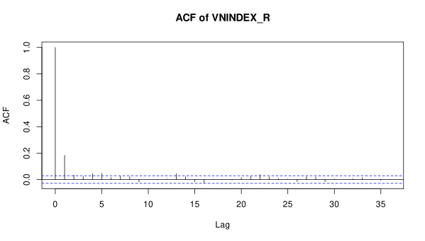
***
***Biểu đồ PACF của VNINDEX_R***  


---
```r
numeric_vars <- c("SP500_R", "USDVND_R", "BRENT_R", "LNVOL", "NFI_VOL")
df_clean[numeric_vars] <- scale(df_clean[numeric_vars])

## Lựa chọn p, k tối ưu dựa trên AIC, BIC và Log-likelihood
model_base <- lm(VNINDEX_R ~ SP500_R + USDVND_R + BRENT_R + LNVOL + NFI_VOL, data = df_clean)
car::vif(model_base)
```

```
##  SP500_R USDVND_R  BRENT_R    LNVOL  NFI_VOL 
## 1.117158 1.000623 1.116743 1.016780 1.016780
```

---
```r
ms_results <- data.frame(
  k = integer(),
  p = integer(),
  AIC = numeric(),
  BIC = numeric(),
  logLik = numeric(),
  stringsAsFactors = FALSE
)

for (k in 2:3) {
  for (p in 0:2) {
    cat("Running model with k =", k, "and p =", p, "\n")
    tryCatch(
      {
        ms_model_try <- msmFit(
          model_base,
          k = k,
          p = p,
          sw = rep(TRUE, length(model_base$coefficients) + 1 + p)
        )
        swi <- ms_model_try@switch[-length(ms_model_try@switch)
        ]
        np <- ms_model_try["k"] * sum(swi) + sum(!swi)
        
        aic_val <- 2 * ms_model_try["Fit"]["logLikel"] + 2 * np
        bic_val <- 2 * ms_model_try["Fit"]["logLikel"] + 2 * np * log(nrow(ms_model_try@model$model))
        logLik_val <- -ms_model_try["Fit"]["logLikel"]
        
        cat(
          "  -> Success: AIC =",
          aic_val,
          ", BIC =",
          bic_val,
          ", logLike =",
          logLik_val,
          "\n"
        )
        ms_results <- rbind(
          ms_results,
          data.frame(
            k = k,
            p = p,
            AIC = aic_val,
            BIC = bic_val,
            logLik = logLik_val
          )
        )
      },
      error = function(e) {
        cat("  -> Error:", conditionMessage(e), "\n")
      }
    )
  }
}
```

```
## Running model with k = 2 and p = 0 
##   -> Success: AIC = -28121.52 , BIC = -27943.09 , logLike = 14072.76 
## Running model with k = 2 and p = 1 
##   -> Success: AIC = -28194.25 , BIC = -27986.08 , logLike = 14111.13 
## Running model with k = 2 and p = 2 
##   -> Success: AIC = -28189.13 , BIC = -27951.23 , logLike = 14110.57 
## Running model with k = 3 and p = 0 
##   -> Success: AIC = -28220.51 , BIC = -27952.86 , logLike = 14128.26 
## Running model with k = 3 and p = 1 
##   -> Success: AIC = -28271.22 , BIC = -27958.96 , logLike = 14156.61 
## Running model with k = 3 and p = 2 
##   -> Success: AIC = -28332.67 , BIC = -27975.81 , logLike = 14190.33 
```

---

```r
ms_results <- arrange(ms_results, AIC, BIC, desc(logLik))
print(ms_results)

k_optimal <- ms_results$k[1]
p_optimal <- ms_results$p[1]

cat("Best-fit model: MS(", k_optimal, ")-AR(", p_optimal, ")-X", sep = "")
```

```
##   k p       AIC       BIC   logLik
## 1 3 2 -28332.67 -27975.81 14190.33
## 2 3 1 -28271.22 -27958.96 14156.61
## 3 3 0 -28220.51 -27952.86 14128.26
## 4 2 1 -28194.25 -27986.08 14111.13
## 5 2 2 -28189.13 -27951.23 14110.57
## 6 2 0 -28121.52 -27943.09 14072.76
## 
## Best-fit model: MS(3)-AR(2)-X
```

---
```r
## Chạy MS model với p, k tối ưu
### Lưu ý: Mỗi lần chạy mô hình sẽ cho ra các thứ tự regime khác nhau
ms_model <- msmFit(
  model_base,
  k = k_optimal,
  p = p_optimal,
  sw = rep(TRUE, length(model_base$coefficients) + 1 + p_optimal)
)
summary(ms_model)
```

```
## Markov Switching Model
## 
## Call: msmFit(object = model_base, k = k_optimal, sw = rep(TRUE, length(model_base$coefficients) + 
##     1 + p_optimal), p = p_optimal)
## 
##         AIC       BIC   logLik
##   -28332.77 -27975.92 14190.39
## 
## Coefficients:
## 
## Regime 1 
## ---------
##                Estimate Std. Error t value  Pr(>|t|)    
## (Intercept)(S)   0.0029     0.0011  2.6364  0.008379 ** 
## SP500_R(S)       0.0008     0.0009  0.8889  0.374057    
## USDVND_R(S)      0.0010     0.0007  1.4286  0.153119    
## BRENT_R(S)      -0.0006     0.0008 -0.7500  0.453255    
## LNVOL(S)         0.0015     0.0009  1.6667  0.095574 .  
## NFI_VOL(S)       0.0046     0.0010  4.6000 4.225e-06 ***
## VNINDEX_R_1(S)  -0.0324     0.0427 -0.7588  0.447972    
## VNINDEX_R_2(S)  -0.4663     0.0606 -7.6947 1.421e-14 ***
## ---
## Signif. codes:  0 ‘***’ 0.001 ‘**’ 0.01 ‘*’ 0.05 ‘.’ 0.1 ‘ ’ 1
## 
## Residual standard error: 0.01318292
## Multiple R-squared: 0.359
## 
## Standardized Residuals:
##           Min            Q1           Med            Q3           Max 
## -0.0329121485 -0.0020292739 -0.0001597442  0.0008967052  0.0395311852 
## 
## Regime 2 
## ---------
##                Estimate Std. Error t value  Pr(>|t|)    
## (Intercept)(S)   0.0008     0.0002  4.0000 6.334e-05 ***
## SP500_R(S)       0.0006     0.0003  2.0000   0.04550 *  
## USDVND_R(S)     -0.0003     0.0002 -1.5000   0.13361    
## BRENT_R(S)       0.0002     0.0002  1.0000   0.31731    
## LNVOL(S)         0.0011     0.0002  5.5000 3.798e-08 ***
## NFI_VOL(S)       0.0015     0.0002  7.5000 6.373e-14 ***
## VNINDEX_R_1(S)   0.0572     0.0230  2.4870   0.01288 *  
## VNINDEX_R_2(S)  -0.0197     0.0213 -0.9249   0.35502    
## ---
## Signif. codes:  0 ‘***’ 0.001 ‘**’ 0.01 ‘*’ 0.05 ‘.’ 0.1 ‘ ’ 1
## 
## Residual standard error: 0.007000966
## Multiple R-squared: 0.05163
## 
## Standardized Residuals:
##           Min            Q1           Med            Q3           Max 
## -2.105680e-02 -2.690097e-03 -2.999715e-07  2.588012e-03  2.079159e-02 
## 
## Regime 3 
## ---------
##                Estimate Std. Error t value  Pr(>|t|)    
## (Intercept)(S)  -0.0046     0.0010 -4.6000 4.225e-06 ***
## SP500_R(S)       0.0004     0.0005  0.8000  0.423711    
## USDVND_R(S)     -0.0007     0.0005 -1.4000  0.161513    
## BRENT_R(S)       0.0023     0.0005  4.6000 4.225e-06 ***
## LNVOL(S)        -0.0022     0.0007 -3.1429  0.001673 ** 
## NFI_VOL(S)      -0.0001     0.0003 -0.3333  0.738908    
## VNINDEX_R_1(S)   0.4612     0.0428 10.7757 < 2.2e-16 ***
## VNINDEX_R_2(S)   0.2654     0.0382  6.9476 3.715e-12 ***
## ---
## Signif. codes:  0 ‘***’ 0.001 ‘**’ 0.01 ‘*’ 0.05 ‘.’ 0.1 ‘ ’ 1
## 
## Residual standard error: 0.01669044
## Multiple R-squared: 0.3038
## 
## Standardized Residuals:
##           Min            Q1           Med            Q3           Max 
## -0.0547206894 -0.0006072776  0.0004015091  0.0031110614  0.0459138081 
## 
## Transition probabilities:
##            Regime 1   Regime 2   Regime 3
## Regime 1 0.11796973 0.01978185 0.46925797
## Regime 2 0.06939801 0.96723314 0.02834268
## Regime 3 0.81263227 0.01298501 0.50239935
```
---

```r
## Xử lý data để thống kê và plot
model_data <- model.frame(model_base)
model_data$Date <- df_clean$DATE
model_data$Date <- as.Date(model_data$Date)
model_data <- model_data[(-p_optimal + 1), ]
model_data$Regime <- apply(ms_model@Fit@smoProb, 1, which.max)
model_data$max_prob <- apply(ms_model@Fit@smoProb, 1, max)
model_data$VNINDEX <- df_clean$VNINDEX[p_optimal:nrow(df_clean)]

model_data_dt <- as.data.table(model_data)
model_data_dt[, regime_group := rleid(Regime)]

## Thống kê
regime_blocks <- model_data_dt[, .(
  Regime = unique(Regime),
  Start = min(Date),
  End = max(Date),
  Duration = .N
), by = regime_group]

sojourn_stats <- regime_blocks %>%
  group_by(Regime) %>%
  summarise(
    Sojourns = n(),
    Mean_Duration = round(mean(Duration), 2),
    Median_Duration = median(Duration),
    Min_Duration = min(Duration),
    Max_Duration = max(Duration),
    SD_Duration = round(sd(Duration), 2)
  )

print(sojourn_stats)
```

```
## # A tibble: 3 × 7
##   Regime Sojourns Mean_Duration Median_Duration Min_Duration Max_Duration SD_Duration
##    <int>    <int>         <dbl>           <dbl>        <int>        <int>       <dbl>
## 1      1      447          1.03               1            1            3        0.19
## 2      2       79         35.8               19            1          345       49.9 
## 3      3      478          2.75               2            1           26        2.57
```
---

```r
## Plot

par(mar = c(3, 3, 3, 3))

plot(ms_model)
plotDiag(ms_model, "all", which = 1)
plotDiag(ms_model, "all", which = 2)
plotDiag(ms_model, "all", which = 3)
plotProb(ms_model, which = c(1:(k_optimal + 1)))
```
***Biểu đồ conditional mean theo từng regime***  
  

***
***Biểu đồ residuals theo từng regime***  
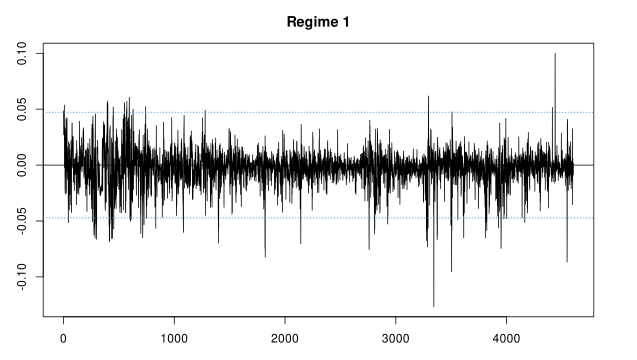  
  
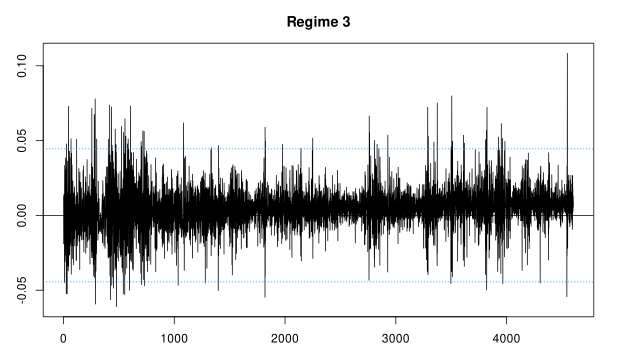  

***
***Biểu đồ Q-Q theo từng regime***  
  
  
  

***
***Biểu đồ ACF, PACF của phần dư và phần dư bình phương***  
  
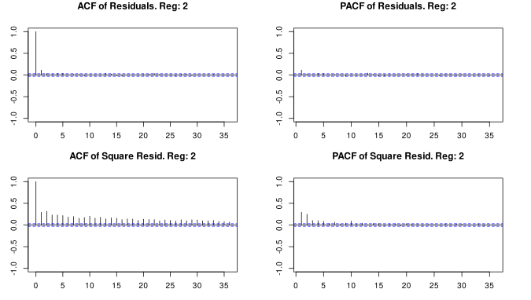  
  

***
***Biểu đồ xác suất chuyển trạng thái filtered và smoothed theo từng regime***  
  

***
***Biểu đồ gán regime từ mô hình***  
  
  
  

---
# EGARCH
```r
# =========================================================================

# Kiểm định ARCH effect
ArchTest(df_clean$VNINDEX_R, lags = 5)
```

```
	ARCH LM-test; Null hypothesis: no ARCH effects

data:  df_clean$VNINDEX_R
Chi-squared = 816.75, df = 5, p-value < 2.2e-16
```

---
```r
# GARCH(1,1)
garch <- ugarchspec(
  variance.model = list(model = "sGARCH", garchOrder = c(1, 1)),
  mean.model = list(armaOrder = c(0, 0), include.mean = TRUE),
  distribution.model = "jsu"
)

garch_fit <- ugarchfit(spec = garch, data = df_clean$VNINDEX_R)

show(garch_fit)
```

```
## *---------------------------------*
## *          GARCH Model Fit        *
## *---------------------------------*
## 
## Conditional Variance Dynamics 	
## -----------------------------------
## GARCH Model	: sGARCH(1,1)
## Mean Model	: ARFIMA(0,0,0)
## Distribution	: jsu 
## 
## Optimal Parameters
## ------------------------------------
##         Estimate  Std. Error  t value Pr(>|t|)
## mu      0.000420    0.000146   2.8867 0.003893
## omega   0.000004    0.000001   2.8569 0.004278
## alpha1  0.152247    0.014385  10.5840 0.000000
## beta1   0.834483    0.014683  56.8332 0.000000
## skew   -0.638705    0.104955  -6.0855 0.000000
## shape   2.072851    0.126321  16.4094 0.000000
## 
## Robust Standard Errors:
##         Estimate  Std. Error  t value Pr(>|t|)
## mu      0.000420    0.000168   2.4971 0.012522
## omega   0.000004    0.000003   1.0966 0.272815
## alpha1  0.152247    0.021500   7.0813 0.000000
## beta1   0.834483    0.029027  28.7483 0.000000
## skew   -0.638705    0.111362  -5.7354 0.000000
## shape   2.072851    0.156512  13.2441 0.000000
## 
## LogLikelihood : 14115.35 
## 
## Information Criteria
## ------------------------------------
##                     
## Akaike       -6.1278
## Bayes        -6.1195
## Shibata      -6.1278
## Hannan-Quinn -6.1249
## 
## Weighted Ljung-Box Test on Standardized Residuals
## ------------------------------------
##                         statistic p-value
## Lag[1]                      82.56       0
## Lag[2*(p+q)+(p+q)-1][2]     85.58       0
## Lag[4*(p+q)+(p+q)-1][5]     95.80       0
## d.o.f=0
## H0 : No serial correlation
## 
## Weighted Ljung-Box Test on Standardized Squared Residuals
## ------------------------------------
##                         statistic p-value
## Lag[1]                     0.1463  0.7021
## Lag[2*(p+q)+(p+q)-1][5]    1.5401  0.7300
## Lag[4*(p+q)+(p+q)-1][9]    2.7412  0.8008
## d.o.f=2
## 
## Weighted ARCH LM Tests
## ------------------------------------
##             Statistic Shape Scale P-Value
## ARCH Lag[3]    0.1480 0.500 2.000  0.7004
## ARCH Lag[5]    0.3266 1.440 1.667  0.9331
## ARCH Lag[7]    0.8725 2.315 1.543  0.9334
## 
## Nyblom stability test
## ------------------------------------
## Joint Statistic:  15.9367
## Individual Statistics:             
## mu     0.4211
## omega  1.0149
## alpha1 3.2260
## beta1  1.9590
## skew   2.5895
## shape  7.6800
## 
## Asymptotic Critical Values (10% 5% 1%)
## Joint Statistic:     	 1.49 1.68 2.12
## Individual Statistic:	 0.35 0.47 0.75
## 
## Sign Bias Test
## ------------------------------------
##                    t-value     prob sig
## Sign Bias           2.5587 0.010538  **
## Negative Sign Bias  0.7188 0.472317    
## Positive Sign Bias  0.8571 0.391409    
## Joint Effect       15.3109 0.001569 ***
## 
## 
## Adjusted Pearson Goodness-of-Fit Test:
## ------------------------------------
##   group statistic p-value(g-1)
## 1    20     39.95     0.003325
## 2    30     50.94     0.007137
## 3    40     68.54     0.002408
## 4    50     63.44     0.080537
## 
## 
## Elapsed time : 0.7081289 
```

---
```r
# AR(1)-GARCH(1,1)
ar_garch <- ugarchspec(
  variance.model = list(model = "sGARCH", garchOrder = c(1, 1)),
  mean.model = list(armaOrder = c(1, 0), include.mean = TRUE),
  distribution.model = "jsu"
)

ar_garch_fit <- ugarchfit(spec = ar_garch, data = df_clean$VNINDEX_R)

show(ar_garch_fit)
```

```
## *---------------------------------*
## *          GARCH Model Fit        *
## *---------------------------------*
## 
## Conditional Variance Dynamics 	
## -----------------------------------
## GARCH Model	: sGARCH(1,1)
## Mean Model	: ARFIMA(1,0,0)
## Distribution	: jsu 
## 
## Optimal Parameters
## ------------------------------------
##         Estimate  Std. Error  t value Pr(>|t|)
## mu      0.000447    0.000159   2.8118 0.004926
## ar1     0.105317    0.015571   6.7637 0.000000
## omega   0.000004    0.000001   2.9616 0.003061
## alpha1  0.159935    0.014671  10.9014 0.000000
## beta1   0.825378    0.015224  54.2143 0.000000
## skew   -0.608885    0.108881  -5.5922 0.000000
## shape   2.135526    0.133939  15.9440 0.000000
## 
## Robust Standard Errors:
##         Estimate  Std. Error  t value Pr(>|t|)
## mu      0.000447    0.000169   2.6478 0.008101
## ar1     0.105317    0.019010   5.5401 0.000000
## omega   0.000004    0.000003   1.1696 0.242145
## alpha1  0.159935    0.020301   7.8781 0.000000
## beta1   0.825378    0.029211  28.2557 0.000000
## skew   -0.608885    0.113661  -5.3570 0.000000
## shape   2.135526    0.170640  12.5148 0.000000
## 
## LogLikelihood : 14138.43 
## 
## Information Criteria
## ------------------------------------
##                     
## Akaike       -6.1374
## Bayes        -6.1276
## Shibata      -6.1374
## Hannan-Quinn -6.1340
## 
## Weighted Ljung-Box Test on Standardized Residuals
## ------------------------------------
##                         statistic   p-value
## Lag[1]                      10.51 1.187e-03
## Lag[2*(p+q)+(p+q)-1][2]     11.43 2.869e-11
## Lag[4*(p+q)+(p+q)-1][5]     18.53 1.257e-07
## d.o.f=1
## H0 : No serial correlation
## 
## Weighted Ljung-Box Test on Standardized Squared Residuals
## ------------------------------------
##                         statistic p-value
## Lag[1]                     0.4099  0.5220
## Lag[2*(p+q)+(p+q)-1][5]    2.4151  0.5241
## Lag[4*(p+q)+(p+q)-1][9]    3.8392  0.6162
## d.o.f=2
## 
## Weighted ARCH LM Tests
## ------------------------------------
##             Statistic Shape Scale P-Value
## ARCH Lag[3]    0.3803 0.500 2.000  0.5374
## ARCH Lag[5]    0.6563 1.440 1.667  0.8367
## ARCH Lag[7]    1.3750 2.315 1.543  0.8461
## 
## Nyblom stability test
## ------------------------------------
## Joint Statistic:  16.2959
## Individual Statistics:             
## mu     0.3156
## ar1    4.0523
## omega  0.6550
## alpha1 3.0489
## beta1  1.9734
## skew   2.1566
## shape  6.9779
## 
## Asymptotic Critical Values (10% 5% 1%)
## Joint Statistic:     	 1.69 1.9 2.35
## Individual Statistic:	 0.35 0.47 0.75
## 
## Sign Bias Test
## ------------------------------------
##                    t-value     prob sig
## Sign Bias           2.2850 0.022358  **
## Negative Sign Bias  0.8634 0.387956    
## Positive Sign Bias  1.2084 0.226961    
## Joint Effect       14.7395 0.002053 ***
## 
## 
## Adjusted Pearson Goodness-of-Fit Test:
## ------------------------------------
##   group statistic p-value(g-1)
## 1    20     29.54     0.057942
## 2    30     32.83     0.284623
## 3    40     54.01     0.055458
## 4    50     75.21     0.009431
## 
## 
## Elapsed time : 0.7872586 
```

---
```r
# AR(1)-GARCH(1,1)-X
ar_garch_x <- ugarchspec(
  variance.model = list(model = "sGARCH", garchOrder = c(1, 1)),
  mean.model = list(
    armaOrder = c(1, 0),
    include.mean = TRUE,
    external.regressors = as.matrix(df_clean[, c("SP500_R", "USDVND_R", "BRENT_R", "LNVOL", "NFI_VOL")])
  ),
  distribution.model = "jsu"
)

ar_garch_x_fit <- ugarchfit(spec = ar_garch_x, data = df_clean$VNINDEX_R)

show(ar_garch_x_fit)
```

```
## *---------------------------------*
## *          GARCH Model Fit        *
## *---------------------------------*
## 
## Conditional Variance Dynamics 	
## -----------------------------------
## GARCH Model	: sGARCH(1,1)
## Mean Model	: ARFIMA(1,0,0)
## Distribution	: jsu 
## 
## Optimal Parameters
## ------------------------------------
##         Estimate  Std. Error  t value Pr(>|t|)
## mu      0.000296    0.000164   1.8039 0.071243
## ar1     0.093537    0.015957   5.8619 0.000000
## mxreg1  0.000336    0.000196   1.7104 0.087198
## mxreg2 -0.000238    0.000119  -1.9994 0.045567
## mxreg3  0.000329    0.000162   2.0268 0.042679
## mxreg4  0.000813    0.000185   4.3848 0.000012
## mxreg5  0.001267    0.000162   7.8256 0.000000
## omega   0.000004    0.000001   2.9785 0.002897
## alpha1  0.166810    0.015329  10.8822 0.000000
## beta1   0.819445    0.015764  51.9811 0.000000
## skew   -0.556026    0.097297  -5.7148 0.000000
## shape   2.053202    0.123182  16.6681 0.000000
## 
## Robust Standard Errors:
##         Estimate  Std. Error  t value Pr(>|t|)
## mu      0.000296    0.000186   1.5914 0.111523
## ar1     0.093537    0.019456   4.8075 0.000002
## mxreg1  0.000336    0.000231   1.4517 0.146593
## mxreg2 -0.000238    0.000084  -2.8405 0.004505
## mxreg3  0.000329    0.000194   1.7000 0.089137
## mxreg4  0.000813    0.000249   3.2704 0.001074
## mxreg5  0.001267    0.000296   4.2815 0.000019
## omega   0.000004    0.000003   1.1965 0.231509
## alpha1  0.166810    0.021034   7.9303 0.000000
## beta1   0.819445    0.030078  27.2444 0.000000
## skew   -0.556026    0.101346  -5.4864 0.000000
## shape   2.053202    0.147851  13.8870 0.000000
## 
## LogLikelihood : 14182.6 
## 
## Information Criteria
## ------------------------------------
##                     
## Akaike       -6.1544
## Bayes        -6.1377
## Shibata      -6.1545
## Hannan-Quinn -6.1485
## 
## Weighted Ljung-Box Test on Standardized Residuals
## ------------------------------------
##                         statistic   p-value
## Lag[1]                      12.45 4.179e-04
## Lag[2*(p+q)+(p+q)-1][2]     12.93 4.919e-13
## Lag[4*(p+q)+(p+q)-1][5]     18.06 2.109e-07
## d.o.f=1
## H0 : No serial correlation
## 
## Weighted Ljung-Box Test on Standardized Squared Residuals
## ------------------------------------
##                         statistic p-value
## Lag[1]                     0.6427  0.4227
## Lag[2*(p+q)+(p+q)-1][5]    4.3770  0.2106
## Lag[4*(p+q)+(p+q)-1][9]    6.2767  0.2676
## d.o.f=2
## 
## Weighted ARCH LM Tests
## ------------------------------------
##             Statistic Shape Scale P-Value
## ARCH Lag[3]    0.7395 0.500 2.000  0.3898
## ARCH Lag[5]    0.9968 1.440 1.667  0.7339
## ARCH Lag[7]    1.7595 2.315 1.543  0.7680
## 
## Nyblom stability test
## ------------------------------------
## Joint Statistic:  17.3876
## Individual Statistics:              
## mu     0.07801
## ar1    3.05635
## mxreg1 0.95250
## mxreg2 0.16426
## mxreg3 0.14487
## mxreg4 0.34165
## mxreg5 0.07030
## omega  0.60677
## alpha1 3.81465
## beta1  2.62026
## skew   1.50227
## shape  7.40806
## 
## Asymptotic Critical Values (10% 5% 1%)
## Joint Statistic:     	 2.69 2.96 3.51
## Individual Statistic:	 0.35 0.47 0.75
## 
## Sign Bias Test
## ------------------------------------
##                    t-value      prob sig
## Sign Bias           2.2815 0.0225657  **
## Negative Sign Bias  0.9318 0.3514972    
## Positive Sign Bias  1.4818 0.1384691    
## Joint Effect       16.3509 0.0009608 ***
## 
## 
## Adjusted Pearson Goodness-of-Fit Test:
## ------------------------------------
##   group statistic p-value(g-1)
## 1    20     24.61       0.1739
## 2    30     37.79       0.1270
## 3    40     39.46       0.4495
## 4    50     54.55       0.2716
## 
## 
## Elapsed time : 1.541786 
```

---
```r
# AR(1)-EGARCH(1,1)-X
ar_egarch_x <- ugarchspec(
  variance.model = list(model = "eGARCH", garchOrder = c(1, 1)),
  mean.model = list(
    armaOrder = c(1, 0),
    include.mean = TRUE,
    external.regressors = as.matrix(df_clean[, c("SP500_R", "USDVND_R", "BRENT_R", "LNVOL", "NFI_VOL")])
  ),
  distribution.model = "jsu"
)

ar_egarch_x_fit <- ugarchfit(spec = ar_egarch_x, data = df_clean$VNINDEX_R)

show(ar_egarch_x_fit)
```

```
## *---------------------------------*
## *          GARCH Model Fit        *
## *---------------------------------*
## 
## Conditional Variance Dynamics 	
## -----------------------------------
## GARCH Model	: eGARCH(1,1)
## Mean Model	: ARFIMA(1,0,0)
## Distribution	: jsu 
## 
## Optimal Parameters
## ------------------------------------
##         Estimate  Std. Error   t value Pr(>|t|)
## mu      0.000188    0.000189   0.99403 0.320209
## ar1     0.101476    0.014868   6.82494 0.000000
## mxreg1  0.000300    0.000158   1.90257 0.057096
## mxreg2 -0.000187    0.000109  -1.70941 0.087375
## mxreg3  0.000319    0.000151   2.10959 0.034894
## mxreg4  0.000792    0.000255   3.10536 0.001900
## mxreg5  0.001338    0.000156   8.54881 0.000000
## omega  -0.303391    0.036406  -8.33354 0.000000
## alpha1 -0.053573    0.010596  -5.05576 0.000000
## beta1   0.966257    0.004051 238.52411 0.000000
## gamma1  0.290667    0.019854  14.64024 0.000000
## skew   -0.530908    0.095873  -5.53761 0.000000
## shape   2.074744    0.126534  16.39676 0.000000
## 
## Robust Standard Errors:
##         Estimate  Std. Error   t value Pr(>|t|)
## mu      0.000188    0.000325   0.57971 0.562112
## ar1     0.101476    0.016772   6.05016 0.000000
## mxreg1  0.000300    0.000162   1.85554 0.063519
## mxreg2 -0.000187    0.000078  -2.39206 0.016754
## mxreg3  0.000319    0.000178   1.78974 0.073497
## mxreg4  0.000792    0.000492   1.60956 0.107495
## mxreg5  0.001338    0.000262   5.10275 0.000000
## omega  -0.303391    0.033321  -9.10499 0.000000
## alpha1 -0.053573    0.012233  -4.37948 0.000012
## beta1   0.966257    0.003713 260.25451 0.000000
## gamma1  0.290667    0.019989  14.54163 0.000000
## skew   -0.530908    0.102400  -5.18467 0.000000
## shape   2.074744    0.151591  13.68648 0.000000
## 
## LogLikelihood : 14203.38 
## 
## Information Criteria
## ------------------------------------
##                     
## Akaike       -6.1630
## Bayes        -6.1449
## Shibata      -6.1630
## Hannan-Quinn -6.1566
## 
## Weighted Ljung-Box Test on Standardized Residuals
## ------------------------------------
##                         statistic   p-value
## Lag[1]                      9.599 1.947e-03
## Lag[2*(p+q)+(p+q)-1][2]    10.113 9.912e-10
## Lag[4*(p+q)+(p+q)-1][5]    15.086 5.454e-06
## d.o.f=1
## H0 : No serial correlation
## 
## Weighted Ljung-Box Test on Standardized Squared Residuals
## ------------------------------------
##                         statistic p-value
## Lag[1]                     0.5454  0.4602
## Lag[2*(p+q)+(p+q)-1][5]    4.9402  0.1579
## Lag[4*(p+q)+(p+q)-1][9]    6.7834  0.2180
## d.o.f=2
## 
## Weighted ARCH LM Tests
## ------------------------------------
##             Statistic Shape Scale P-Value
## ARCH Lag[3]    0.4248 0.500 2.000  0.5146
## ARCH Lag[5]    0.7311 1.440 1.667  0.8140
## ARCH Lag[7]    1.3985 2.315 1.543  0.8415
## 
## Nyblom stability test
## ------------------------------------
## Joint Statistic:  15.6279
## Individual Statistics:              
## mu     0.07781
## ar1    3.30913
## mxreg1 0.88033
## mxreg2 0.18030
## mxreg3 0.12921
## mxreg4 0.25797
## mxreg5 0.05909
## omega  2.37867
## alpha1 2.32915
## beta1  2.06974
## gamma1 0.90985
## skew   1.96768
## shape  5.89988
## 
## Asymptotic Critical Values (10% 5% 1%)
## Joint Statistic:     	 2.89 3.15 3.69
## Individual Statistic:	 0.35 0.47 0.75
## 
## Sign Bias Test
## ------------------------------------
##                    t-value    prob sig
## Sign Bias           2.2085 0.02726  **
## Negative Sign Bias  1.4894 0.13644    
## Positive Sign Bias  0.8519 0.39430    
## Joint Effect       10.1852 0.01706  **
## 
## 
## Adjusted Pearson Goodness-of-Fit Test:
## ------------------------------------
##   group statistic p-value(g-1)
## 1    20     15.86       0.6666
## 2    30     29.42       0.4435
## 3    40     28.86       0.8828
## 4    50     47.13       0.5493
## 
## 
## Elapsed time : 2.356594 
```

---
```r
# AR(1)-GJR-GARCH(1,1)-X
ar_gjr_garch_x <- ugarchspec(
  variance.model = list(model = "gjrGARCH", garchOrder = c(1, 1)),
  mean.model = list(
    armaOrder = c(1, 0),
    include.mean = TRUE,
    external.regressors = as.matrix(df_clean[, c("SP500_R", "USDVND_R", "BRENT_R", "LNVOL", "NFI_VOL")])
  ),
  distribution.model = "jsu"
)

ar_gjr_garch_x_fit <- ugarchfit(spec = ar_gjr_garch_x, data = df_clean$VNINDEX_R)

show(ar_gjr_garch_x_fit)
```

```
## *---------------------------------*
## *          GARCH Model Fit        *
## *---------------------------------*
## 
## Conditional Variance Dynamics 	
## -----------------------------------
## GARCH Model	: gjrGARCH(1,1)
## Mean Model	: ARFIMA(1,0,0)
## Distribution	: jsu 
## 
## Optimal Parameters
## ------------------------------------
##         Estimate  Std. Error  t value Pr(>|t|)
## mu      0.000205    0.000167   1.2238 0.221035
## ar1     0.104888    0.016430   6.3838 0.000000
## mxreg1  0.000319    0.000196   1.6263 0.103889
## mxreg2 -0.000233    0.000118  -1.9813 0.047557
## mxreg3  0.000321    0.000163   1.9716 0.048655
## mxreg4  0.000743    0.000186   4.0017 0.000063
## mxreg5  0.001291    0.000162   7.9640 0.000000
## omega   0.000005    0.000001   3.0561 0.002242
## alpha1  0.132592    0.015181   8.7339 0.000000
## beta1   0.809917    0.016101  50.3029 0.000000
## gamma1  0.079406    0.022684   3.5005 0.000464
## skew   -0.521726    0.094115  -5.5435 0.000000
## shape   2.045979    0.123597  16.5537 0.000000
## 
## Robust Standard Errors:
##         Estimate  Std. Error  t value Pr(>|t|)
## mu      0.000205    0.000197   1.0380 0.299267
## ar1     0.104888    0.020073   5.2254 0.000000
## mxreg1  0.000319    0.000231   1.3803 0.167496
## mxreg2 -0.000233    0.000081  -2.8841 0.003925
## mxreg3  0.000321    0.000194   1.6511 0.098716
## mxreg4  0.000743    0.000249   2.9897 0.002792
## mxreg5  0.001291    0.000283   4.5652 0.000005
## omega   0.000005    0.000004   1.1648 0.244106
## alpha1  0.132592    0.016410   8.0801 0.000000
## beta1   0.809917    0.031545  25.6748 0.000000
## gamma1  0.079406    0.033769   2.3514 0.018702
## skew   -0.521726    0.101053  -5.1629 0.000000
## shape   2.045979    0.153863  13.2974 0.000000
## 
## LogLikelihood : 14190.23 
## 
## Information Criteria
## ------------------------------------
##                     
## Akaike       -6.1573
## Bayes        -6.1392
## Shibata      -6.1573
## Hannan-Quinn -6.1509
## 
## Weighted Ljung-Box Test on Standardized Residuals
## ------------------------------------
##                         statistic   p-value
## Lag[1]                      10.40 1.261e-03
## Lag[2*(p+q)+(p+q)-1][2]     10.80 1.598e-10
## Lag[4*(p+q)+(p+q)-1][5]     16.19 1.646e-06
## d.o.f=1
## H0 : No serial correlation
## 
## Weighted Ljung-Box Test on Standardized Squared Residuals
## ------------------------------------
##                         statistic p-value
## Lag[1]                      1.486  0.2228
## Lag[2*(p+q)+(p+q)-1][5]     3.961  0.2590
## Lag[4*(p+q)+(p+q)-1][9]     5.789  0.3232
## d.o.f=2
## 
## Weighted ARCH LM Tests
## ------------------------------------
##             Statistic Shape Scale P-Value
## ARCH Lag[3]     1.195 0.500 2.000  0.2742
## ARCH Lag[5]     1.664 1.440 1.667  0.5502
## ARCH Lag[7]     2.334 2.315 1.543  0.6469
## 
## Nyblom stability test
## ------------------------------------
## Joint Statistic:  16.5411
## Individual Statistics:              
## mu     0.06873
## ar1    3.03198
## mxreg1 0.99821
## mxreg2 0.18489
## mxreg3 0.14301
## mxreg4 0.26557
## mxreg5 0.06494
## omega  0.77321
## alpha1 5.38019
## beta1  3.34711
## gamma1 2.26338
## skew   2.13905
## shape  8.24076
## 
## Asymptotic Critical Values (10% 5% 1%)
## Joint Statistic:     	 2.89 3.15 3.69
## Individual Statistic:	 0.35 0.47 0.75
## 
## Sign Bias Test
## ------------------------------------
##                    t-value    prob sig
## Sign Bias            2.357 0.01844  **
## Negative Sign Bias   1.853 0.06392   *
## Positive Sign Bias   1.094 0.27416    
## Joint Effect        12.568 0.00567 ***
## 
## 
## Adjusted Pearson Goodness-of-Fit Test:
## ------------------------------------
##   group statistic p-value(g-1)
## 1    20     21.07       0.3329
## 2    30     35.42       0.1910
## 3    40     34.28       0.6849
## 4    50     49.95       0.4354
## 
## 
## Elapsed time : 2.20274 
```

---
```r
model_summary <- function(model) {
  c(
    AIC = infocriteria(model)[1],
    BIC = infocriteria(model)[2],
    logLik = likelihood(model)
  )
}

garch_results <- rbind(
  "GARCH(1,1)" = model_summary(garch_fit),
  "AR(1)-GARCH(1,1)" = model_summary(ar_garch_fit),
  "AR(1)-GARCH(1,1)-X" = model_summary(ar_garch_x_fit),
  "AR(1)-EGARCH(1,1)-X" = model_summary(ar_egarch_x_fit),
  "AR(1)-GJR-GARCH(1,1)-X" = model_summary(ar_gjr_garch_x_fit)
)

garch_results <- as.data.frame(garch_results)
garch_results <- arrange(garch_results, AIC, BIC, desc(logLik))
print(garch_results)
cat("Best-fit model:", rownames(garch_results)[1])
```

```
##                              AIC       BIC   logLik
## AR(1)-EGARCH(1,1)-X    -6.163031 -6.144865 14203.38
## AR(1)-GJR-GARCH(1,1)-X -6.157322 -6.139156 14190.23
## AR(1)-GARCH(1,1)-X     -6.154440 -6.137671 14182.60
## AR(1)-GARCH(1,1)       -6.137428 -6.127647 14138.43
## GARCH(1,1)             -6.127838 -6.119454 14115.35
## 
## Best-fit model: AR(1)-EGARCH(1,1)-X
```

---
```r
## Plot
par(mfrow = c(1, 1))
plot(
  df_clean$DATE,
  sigma(ar_egarch_x_fit),
  type = "l",
  col = "palegreen3",
  main = "Conditional Volatility (EGARCH)",
  xlab = "Date",
  ylab = ""
)
plot(
  df_clean$DATE,
  residuals(ar_egarch_x_fit, standardize = TRUE),
  type = "l",
  col = "palegreen3",
  main = "Standardized Residuals",
  xlab = "Date",
  ylab = ""
)
qqnorm(residuals(ar_egarch_x_fit, standardize = TRUE))
qqline(residuals(ar_egarch_x_fit, standardize = TRUE), col = "red")
hist(
  residuals(ar_egarch_x_fit, standardize = TRUE),
  breaks = 50,
  main = "Histogram of Standardized Residuals",
  probability = TRUE,
  xlab = ""
)

ni <- newsimpact(ar_egarch_x_fit)
ni_df <- data.frame(z = ni$zx, h = ni$zy)
ggplot(ni_df, aes(x = z, y = h)) +
  geom_line(color = "palegreen3", size = 1.2) +
  geom_vline(
    xintercept = 0,
    linetype = "dashed",
    color = "gray50"
  ) +
  labs(title = "News Impact Curve – AR(1)-EGARCH(1,1)-X", x = "Shock", y = "Conditional Variance") +
  theme_minimal(base_size = 14)
```

***Biểu đồ chuỗi độ biến động có điều kiện (conditional volatility)***  
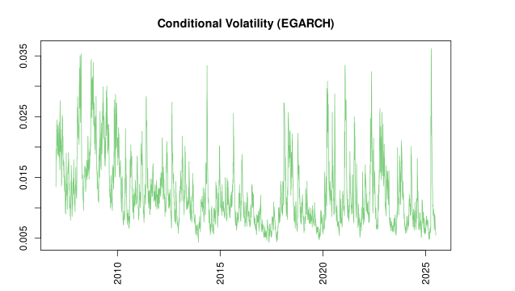  

***
***Biểu đồ phần dư chuẩn hoá (standardized residuals)***  
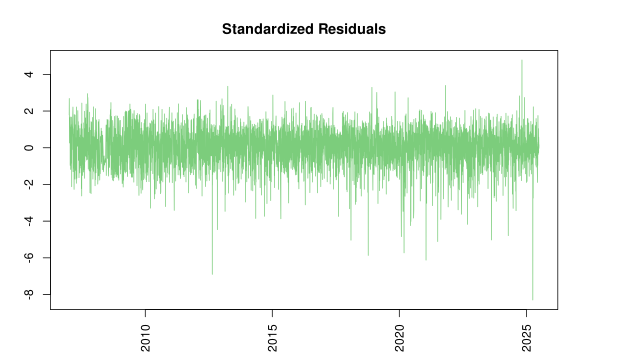  

***
***Biểu đồ Q-Q của phần dư chuẩn hóa***  
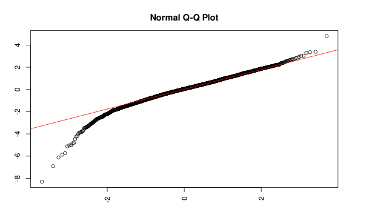  

***
***Biểu đồ histogram của phần dư chuẩn hóa***  
  

***
***Đường cong tác động thông tin (News Impact Curve)***  
  

---
# QUANTILE REGRESSION
```r
# Kiểm định phương sai thay đổi (Heteroskedasticity)
ols_model <- lm(VNINDEX_R ~ SP500_R + USDVND_R + BRENT_R + LNVOL + NFI_VOL, data = df_clean)
bptest(ols_model)
```

```
## 	studentized Breusch-Pagan test
## 
## data:  ols_model
## BP = 123.45, df = 5, p-value < 2.2e-16
```

---
```r
# Hồi quy Phân vị
taus <- c(0.1, 0.25, 0.5, 0.75, 0.9)
qr_models <- lapply(taus, function(tau) {
  rq(
    VNINDEX_R ~ SP500_R + USDVND_R + BRENT_R + LNVOL + NFI_VOL,
    data = df_clean,
    tau = tau
  )
})
for (i in seq_along(taus)) {
  cat("\n\n--- Quantile:", taus[i], "---\n")
  print(summary(qr_models[[i]], se = "boot"))
}
```

```
## --- Quantile: 0.1 ---
## 
## Call: rq(formula = VNINDEX_R ~ SP500_R + USDVND_R + BRENT_R + LNVOL + 
##     NFI_VOL, tau = tau, data = df_clean)
## 
## tau: [1] 0.1
## 
## Coefficients:
##             Value     Std. Error t value   Pr(>|t|) 
## (Intercept)  -0.01499   0.00049  -30.70946   0.00000
## SP500_R       0.00035   0.00047    0.75305   0.45146
## USDVND_R     -0.00045   0.00038   -1.18075   0.23776
## BRENT_R       0.00181   0.00040    4.49583   0.00001
## LNVOL         0.00318   0.00053    5.98626   0.00000
## NFI_VOL       0.00053   0.00066    0.80158   0.42284
## 
## 
## --- Quantile: 0.25 ---
## 
## Call: rq(formula = VNINDEX_R ~ SP500_R + USDVND_R + BRENT_R + LNVOL + 
##     NFI_VOL, tau = tau, data = df_clean)
## 
## tau: [1] 0.25
## 
## Coefficients:
##             Value     Std. Error t value   Pr(>|t|) 
## (Intercept)  -0.00618   0.00026  -23.45590   0.00000
## SP500_R       0.00058   0.00037    1.57399   0.11556
## USDVND_R      0.00003   0.00025    0.10679   0.91496
## BRENT_R       0.00103   0.00036    2.86281   0.00422
## LNVOL         0.00277   0.00028   10.05541   0.00000
## NFI_VOL       0.00130   0.00027    4.86286   0.00000
## 
## 
## --- Quantile: 0.5 ---
## 
## Call: rq(formula = VNINDEX_R ~ SP500_R + USDVND_R + BRENT_R + LNVOL + 
##     NFI_VOL, tau = tau, data = df_clean)
## 
## tau: [1] 0.5
## 
## Coefficients:
##             Value    Std. Error t value  Pr(>|t|)
## (Intercept)  0.00077  0.00019    4.18365  0.00003
## SP500_R      0.00027  0.00031    0.87116  0.38371
## USDVND_R    -0.00016  0.00026   -0.59840  0.54960
## BRENT_R      0.00043  0.00019    2.22952  0.02583
## LNVOL        0.00106  0.00023    4.57642  0.00000
## NFI_VOL      0.00138  0.00024    5.84560  0.00000
## 
## 
## --- Quantile: 0.75 ---
## 
## Call: rq(formula = VNINDEX_R ~ SP500_R + USDVND_R + BRENT_R + LNVOL + 
##     NFI_VOL, tau = tau, data = df_clean)
## 
## tau: [1] 0.75
## 
## Coefficients:
##             Value    Std. Error t value  Pr(>|t|)
## (Intercept)  0.00726  0.00020   36.31019  0.00000
## SP500_R      0.00042  0.00034    1.24722  0.21238
## USDVND_R    -0.00019  0.00026   -0.72175  0.47048
## BRENT_R      0.00034  0.00033    1.01275  0.31123
## LNVOL       -0.00074  0.00028   -2.67548  0.00749
## NFI_VOL      0.00148  0.00037    4.02612  0.00006
## 
## 
## --- Quantile: 0.9 ---
## 
## Call: rq(formula = VNINDEX_R ~ SP500_R + USDVND_R + BRENT_R + LNVOL + 
##     NFI_VOL, tau = tau, data = df_clean)
## 
## tau: [1] 0.9
## 
## Coefficients:
##             Value    Std. Error t value  Pr(>|t|)
## (Intercept)  0.01497  0.00037   40.51399  0.00000
## SP500_R      0.00041  0.00039    1.05139  0.29313
## USDVND_R    -0.00037  0.00034   -1.09299  0.27446
## BRENT_R      0.00055  0.00039    1.38392  0.16645
## LNVOL       -0.00264  0.00039   -6.80764  0.00000
## NFI_VOL      0.00147  0.00040    3.63738  0.00028
```

---
```r
# Plot
coef_data <- do.call(rbind, lapply(seq_along(taus), function(i) {
  cbind(tau = taus[i], as.data.frame(t(coef(qr_models[[i]]))))
}))

coef_melted <- melt(coef_data, id.vars = "tau")

variable_order <- c(
  "(Intercept)",
  "SP500_R",
  "USDVND_R",
  "BRENT_R",
  "LNVOL",
  "NFI_VOL"
)
coef_melted$variable <- factor(coef_melted$variable, levels = variable_order)

custom_colors <- brewer.pal(6, "Set2")

ggplot(
  coef_melted,
  aes(
    x = tau,
    y = value,
    color = variable,
    group = variable
  )
) +
  geom_hline(
    yintercept = 0,
    color = "gray50",
    linetype = "dashed",
    size = 0.6
  ) +
  geom_line(size = 1) +
  geom_point(
    size = 2,
    shape = 21,
    fill = "white",
    stroke = 1
  ) +
  scale_color_manual(values = custom_colors) +
  scale_x_continuous(
    breaks = unique(coef_melted$tau),
    labels = function(x) {
      paste0(x * 100, "%")
    }
  ) +
  scale_y_continuous(breaks = pretty_breaks(n = 8)) +
  labs(
    title = "Quantile Regression Coefficients",
    x = "Quantile (τ)",
    y = "Coefficient Value",
    color = "Variable"
  ) +
  theme_minimal(base_size = 14) +
  theme(
    panel.grid.minor = element_blank(),
    panel.grid.major = element_line(color = "gray92"),
    axis.line = element_line(color = "gray30", size = 0.6),
    plot.title = element_text(face = "bold", size = 18, hjust = 0.5),
    plot.subtitle = element_text(
      face = "italic",
      size = 12,
      hjust = 0.5,
      margin = margin(b = 15)
    ),
    legend.position = "bottom",
    legend.background = element_rect(fill = "white", color = "gray90"),
    legend.margin = margin(
      t = 0,
      r = 5,
      b = 0,
      l = 5
    ),
    legend.key.size = unit(1.2, "cm"),
    legend.title = element_text(face = "bold"),
    axis.title = element_text(face = "bold", margin = margin(
      t = 10,
      r = 10,
      b = 10,
      l = 10
    )),
    plot.background = element_rect(fill = "white", color = NA),
    panel.border = element_rect(
      color = "gray80",
      fill = NA,
      size = 0.6
    )
  )

plot_list <- list()
for (i in seq_along(taus)) {
  p <- ggplot(data.frame(residuals = resid(qr_models[[i]])), aes(x = residuals)) +
    geom_density(
      fill = "palegreen3",
      alpha = 0.7,
      color = "black"
    ) +
    labs(
      title = paste("τ =", taus[i]),
      x = "Residuals",
      y = "Density"
    ) +
    theme_minimal(base_size = 12) +
    theme(plot.title = element_text(hjust = 0.5, face = "bold"))
  
  plot_list[[i]] <- p
}
title <- grid::textGrob(
  "Distribution of Residuals Across Quantiles",
  gp = grid::gpar(fontface = "bold", fontsize = 16)
)
combined_plot <- grid.arrange(grobs = plot_list, ncol = 2, top = title)
print(combined_plot)
```

***Biểu đồ hệ số hồi quy theo từng phân vị***  
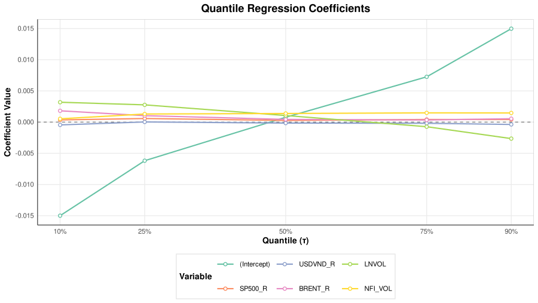  

***
***Biểu đồ phân phối phần dư tại các phân vị***  
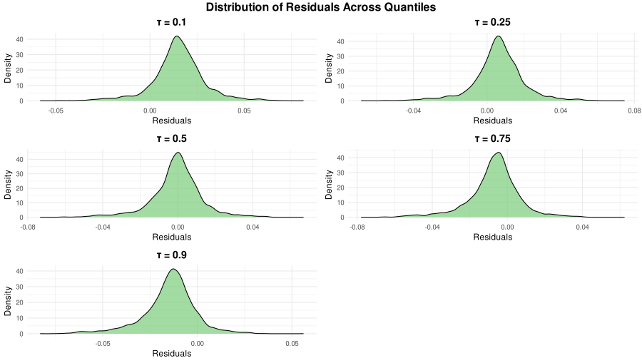  