# THỐNG KÊ MÔ TẢ
```r
options(warn = -1)
# Kiểm tra, cài đặt và load các package cần thiết

packages <- c(
  "MSwM",
  "forecast",
  "readxl",
  "tseries",
  "dplyr",
  "gridExtra",
  "ggplot2",
  "data.table",
  "zoo",
  "tidyverse",
  "moments",
  "rlang",
  "rugarch",
  "FinTS",
  "RColorBrewer",
  "tvReg",
  "reshape2",
  "quantreg",
  "lmtest",
  "nonlinearTseries",
  "scales"
)
install_if_missing <- function(pkg) {
  if (!requireNamespace(pkg, quietly = TRUE)) {
    install.packages(pkg, quiet = TRUE)
  }
}
invisible(sapply(packages, install_if_missing))
invisible(sapply(packages, function(pkg) {
  suppressMessages(suppressWarnings(library(pkg, character.only = TRUE)))
}))

# =========================================================================

# Import và tiền xử lý data
df <- read_excel("~/KLTN/data.xlsx", sheet = "processed")

df <- df %>% arrange(DATE)

df$LNVOL <- log(df$VNINDEX_VOL)

df_clean <- df %>%
  arrange(DATE) %>%
  drop_na()

# =========================================================================

# Thống kê mô tả
desc_stats <- function(x) {
  c(
    Mean = mean(x),
    SD = sd(x),
    Min = min(x),
    Max = max(x),
    Skewness = skewness(x),
    Kurtosis = kurtosis(x),
    "JB p-value" = jarque.bera.test(x)$p.value
  )
}

desc_table <- sapply(df_clean[, c(
  "VNINDEX_R",
  "SP500_R",
  "USDVND_R",
  "BRENT_R",
  "LNVOL",
  "NFI_VOL"
)], desc_stats)
desc_table <- t(round(desc_table, 4))
desc_table
```

```
                   Mean         SD           Min          Max Skewness Kurtosis JB p-value
VNINDEX_R        0.0001 1.3700e-02 -6.910000e-02 6.550000e-02  -0.4424   5.4897          0
SP500_R          0.0003 1.2600e-02 -1.277000e-01 1.096000e-01  -0.4383  15.6121          0
USDVND_R         0.0001 4.6000e-03 -1.208000e-01 1.219000e-01   0.7518 257.9072          0
BRENT_R          0.0000 2.3700e-02 -2.798000e-01 3.212000e-01  -0.3306  21.8774          0
LNVOL           18.6008 1.4529e+00  1.397550e+01 2.140890e+01  -0.4229   2.5759          0
NFI_VOL   -1072124.6080 1.2835e+07 -2.848878e+08 1.905554e+08  -1.9556  84.2485          0
```

---
```r
# Plot
vars <- c(
  "VNINDEX_R",
  "SP500_R",
  "USDVND_R",
  "BRENT_R",
  "LNVOL",
  "NFI_VOL"
)

## Line plot
p_list <- lapply(vars, function(v) {
  ggplot(df_clean, aes_string(x = "DATE", y = v)) +
    geom_line(color = "palegreen3") +
    labs(x = "Date", y = v) +
    theme_minimal()
})
grid.arrange(grobs = p_list, ncol = 2)
```

***Biểu đồ đường của các biến theo thời gian***  


---
```r
## Histogram + Density plot
hist_list <- lapply(vars, function(v) {
  ggplot(df_clean, aes_string(x = v)) +
    geom_histogram(
      aes(y = ..density..),
      bins = 60,
      fill = "palegreen3",
      color = "gray"
    ) +
    geom_density(color = "salmon", linewidth = 1) +
    labs(
      title = paste("Histogram & Density of", v),
      x = v,
      y = "Density"
    ) +
    theme_minimal()
})
grid.arrange(grobs = hist_list, ncol = 2)
```

***Histogram và mật độ kernel của các biến***  


---
```r
## QQ plot
qq_list <- lapply(vars, function(v) {
  ggplot(df_clean, aes(sample = .data[[v]])) +
    stat_qq() +
    stat_qq_line(color = "salmon") +
    labs(
      title = paste("QQ Plot:", v),
      x = "Theoretical Quantiles",
      y = "Sample Quantiles"
    ) +
    theme_minimal()
})
grid.arrange(grobs = qq_list, ncol = 2)
```

***Biểu đồ QQ của các biến***  


---
# MARKOV SWITCHING MODEL
```r
# =========================================================================

# Markov Switching Model

## Kiểm tra tính dừng
adf.test(df_clean$VNINDEX_R, alternative = "stationary")
adf.test(df_clean$SP500_R, alternative = "stationary")
adf.test(df_clean$USDVND_R, alternative = "stationary")
adf.test(df_clean$BRENT_R, alternative = "stationary")
adf.test(df_clean$LNVOL, alternative = "stationary")
adf.test(df_clean$NFI_VOL, alternative = "stationary")

## Kiểm định tuyến tính (Tsay test)
tsay <- tsayTest(df_clean$VNINDEX_R, order = 2)

cat(
  paste0(
    "\n\tTsay Test for Nonlinearity\n\n",
    "data:  df_clean$VNINDEX_R\n",
    "Tsay statistic = ",
    round(tsay$test.stat, 4),
    " , AR order = ",
    tsay$order,
    " , p-value = ",
    format.pval(tsay$p.value, digits = 5),
    "\n",
    "alternative hypothesis: nonlinearity in the time series\n"
  )
)
```

```
	Augmented Dickey-Fuller Test

data:  df_clean$VNINDEX_R
Dickey-Fuller = -15.791, Lag order = 16, p-value = 0.01
alternative hypothesis: stationary


	Augmented Dickey-Fuller Test

data:  df_clean$SP500_R
Dickey-Fuller = -16.5, Lag order = 16, p-value = 0.01
alternative hypothesis: stationary


	Augmented Dickey-Fuller Test

data:  df_clean$USDVND_R
Dickey-Fuller = -16.501, Lag order = 16, p-value = 0.01
alternative hypothesis: stationary


	Augmented Dickey-Fuller Test

data:  df_clean$BRENT_R
Dickey-Fuller = -14.98, Lag order = 16, p-value = 0.01
alternative hypothesis: stationary


	Augmented Dickey-Fuller Test

data:  df_clean$LNVOL
Dickey-Fuller = -5.5323, Lag order = 16, p-value = 0.01
alternative hypothesis: stationary


	Augmented Dickey-Fuller Test

data:  df_clean$NFI_VOL
Dickey-Fuller = -10.98, Lag order = 16, p-value = 0.01
alternative hypothesis: stationary


	Tsay Test for Nonlinearity

data:  df_clean$VNINDEX_R
Tsay statistic = 10.6534 , AR order = 2 , p-value = 5.6205e-07
alternative hypothesis: nonlinearity in the time series
```

---
```r
## ACF, PACF của VNINDEX_R
acf(df$VNINDEX_R, main = "ACF of VNINDEX_R")
pacf(df$VNINDEX_R, main = "PACF of VNINDEX_R")
```

***Biểu đồ ACF của VNINDEX_R***  

***
***Biểu đồ PACF của VNINDEX_R***  


---
```r
numeric_vars <- c("SP500_R", "USDVND_R", "BRENT_R", "LNVOL", "NFI_VOL")
df_clean[numeric_vars] <- scale(df_clean[numeric_vars])

## Lựa chọn p, k tối ưu dựa trên AIC, BIC và Log-likelihood
model_base <- lm(VNINDEX_R ~ SP500_R + USDVND_R + BRENT_R + LNVOL + NFI_VOL, data = df_clean)
car::vif(model_base)
```

```
 SP500_R USDVND_R  BRENT_R    LNVOL  NFI_VOL 
1.117158 1.000623 1.116743 1.016780 1.016780
```

---
```r
ms_results <- data.frame(
  k = integer(),
  p = integer(),
  AIC = numeric(),
  BIC = numeric(),
  logLik = numeric(),
  stringsAsFactors = FALSE
)

for (k in 2:3) {
  for (p in 0:2) {
    cat("Running model with k =", k, "and p =", p, "\n")
    tryCatch(
      {
        ms_model_try <- msmFit(
          model_base,
          k = k,
          p = p,
          sw = rep(TRUE, length(model_base$coefficients) + 1 + p)
        )
        swi <- ms_model_try@switch[-length(ms_model_try@switch)
        ]
        np <- ms_model_try["k"] * sum(swi) + sum(!swi)
        
        aic_val <- 2 * ms_model_try["Fit"]["logLikel"] + 2 * np
        bic_val <- 2 * ms_model_try["Fit"]["logLikel"] + 2 * np * log(nrow(ms_model_try@model$model))
        logLik_val <- -ms_model_try["Fit"]["logLikel"]
        
        cat(
          "  -> Success: AIC =",
          aic_val,
          ", BIC =",
          bic_val,
          ", logLike =",
          logLik_val,
          "\n"
        )
        ms_results <- rbind(
          ms_results,
          data.frame(
            k = k,
            p = p,
            AIC = aic_val,
            BIC = bic_val,
            logLik = logLik_val
          )
        )
      },
      error = function(e) {
        cat("  -> Error:", conditionMessage(e), "\n")
      }
    )
  }
}
```

```
Running model with k = 2 and p = 0 
  -> Success: AIC = -28121.52 , BIC = -27943.09 , logLike = 14072.76 
Running model with k = 2 and p = 1 
  -> Success: AIC = -28194.25 , BIC = -27986.08 , logLike = 14111.13 
Running model with k = 2 and p = 2 
  -> Success: AIC = -28189.13 , BIC = -27951.23 , logLike = 14110.57 
Running model with k = 3 and p = 0 
  -> Success: AIC = -28220.51 , BIC = -27952.86 , logLike = 14128.26 
Running model with k = 3 and p = 1 
  -> Success: AIC = -28271.22 , BIC = -27958.96 , logLike = 14156.61 
Running model with k = 3 and p = 2 
  -> Success: AIC = -28332.67 , BIC = -27975.81 , logLike = 14190.33 
```

---

```r
ms_results <- arrange(ms_results, AIC, BIC, desc(logLik))
print(ms_results)

k_optimal <- ms_results$k[1]
p_optimal <- ms_results$p[1]

cat("Best-fit model: MS(", k_optimal, ")-AR(", p_optimal, ")-X", sep = "")
```

```
  k p       AIC       BIC   logLik
1 3 2 -28332.67 -27975.81 14190.33
2 3 1 -28271.22 -27958.96 14156.61
3 3 0 -28220.51 -27952.86 14128.26
4 2 1 -28194.25 -27986.08 14111.13
5 2 2 -28189.13 -27951.23 14110.57
6 2 0 -28121.52 -27943.09 14072.76

Best-fit model: MS(3)-AR(2)-X
```

---
```r
## Chạy MS model với p, k tối ưu
### Lưu ý: Mỗi lần chạy mô hình sẽ cho ra các thứ tự regime khác nhau
ms_model <- msmFit(
  model_base,
  k = k_optimal,
  p = p_optimal,
  sw = rep(TRUE, length(model_base$coefficients) + 1 + p_optimal)
)
summary(ms_model)
```

```
Markov Switching Model

Call: msmFit(object = model_base, k = k_optimal, sw = rep(TRUE, length(model_base$coefficients) + 
    1 + p_optimal), p = p_optimal)

        AIC       BIC   logLik
  -28332.77 -27975.92 14190.39

Coefficients:

Regime 1 
---------
               Estimate Std. Error t value  Pr(>|t|)    
(Intercept)(S)   0.0029     0.0011  2.6364  0.008379 ** 
SP500_R(S)       0.0008     0.0009  0.8889  0.374057    
USDVND_R(S)      0.0010     0.0007  1.4286  0.153119    
BRENT_R(S)      -0.0006     0.0008 -0.7500  0.453255    
LNVOL(S)         0.0015     0.0009  1.6667  0.095574 .  
NFI_VOL(S)       0.0046     0.0010  4.6000 4.225e-06 ***
VNINDEX_R_1(S)  -0.0324     0.0427 -0.7588  0.447972    
VNINDEX_R_2(S)  -0.4663     0.0606 -7.6947 1.421e-14 ***
---
Signif. codes:  0 ‘***’ 0.001 ‘**’ 0.01 ‘*’ 0.05 ‘.’ 0.1 ‘ ’ 1

Residual standard error: 0.01318292
Multiple R-squared: 0.359

Standardized Residuals:
          Min            Q1           Med            Q3           Max 
-0.0329121485 -0.0020292739 -0.0001597442  0.0008967052  0.0395311852 

Regime 2 
---------
               Estimate Std. Error t value  Pr(>|t|)    
(Intercept)(S)   0.0008     0.0002  4.0000 6.334e-05 ***
SP500_R(S)       0.0006     0.0003  2.0000   0.04550 *  
USDVND_R(S)     -0.0003     0.0002 -1.5000   0.13361    
BRENT_R(S)       0.0002     0.0002  1.0000   0.31731    
LNVOL(S)         0.0011     0.0002  5.5000 3.798e-08 ***
NFI_VOL(S)       0.0015     0.0002  7.5000 6.373e-14 ***
VNINDEX_R_1(S)   0.0572     0.0230  2.4870   0.01288 *  
VNINDEX_R_2(S)  -0.0197     0.0213 -0.9249   0.35502    
---
Signif. codes:  0 ‘***’ 0.001 ‘**’ 0.01 ‘*’ 0.05 ‘.’ 0.1 ‘ ’ 1

Residual standard error: 0.007000966
Multiple R-squared: 0.05163

Standardized Residuals:
          Min            Q1           Med            Q3           Max 
-2.105680e-02 -2.690097e-03 -2.999715e-07  2.588012e-03  2.079159e-02 

Regime 3 
---------
               Estimate Std. Error t value  Pr(>|t|)    
(Intercept)(S)  -0.0046     0.0010 -4.6000 4.225e-06 ***
SP500_R(S)       0.0004     0.0005  0.8000  0.423711    
USDVND_R(S)     -0.0007     0.0005 -1.4000  0.161513    
BRENT_R(S)       0.0023     0.0005  4.6000 4.225e-06 ***
LNVOL(S)        -0.0022     0.0007 -3.1429  0.001673 ** 
NFI_VOL(S)      -0.0001     0.0003 -0.3333  0.738908    
VNINDEX_R_1(S)   0.4612     0.0428 10.7757 < 2.2e-16 ***
VNINDEX_R_2(S)   0.2654     0.0382  6.9476 3.715e-12 ***
---
Signif. codes:  0 ‘***’ 0.001 ‘**’ 0.01 ‘*’ 0.05 ‘.’ 0.1 ‘ ’ 1

Residual standard error: 0.01669044
Multiple R-squared: 0.3038

Standardized Residuals:
          Min            Q1           Med            Q3           Max 
-0.0547206894 -0.0006072776  0.0004015091  0.0031110614  0.0459138081 

Transition probabilities:
           Regime 1   Regime 2   Regime 3
Regime 1 0.11796973 0.01978185 0.46925797
Regime 2 0.06939801 0.96723314 0.02834268
Regime 3 0.81263227 0.01298501 0.50239935
```
---

```r
## Xử lý data để thống kê và plot
model_data <- model.frame(model_base)
model_data$Date <- df_clean$DATE
model_data$Date <- as.Date(model_data$Date)
model_data <- model_data[(-p_optimal + 1), ]
model_data$Regime <- apply(ms_model@Fit@smoProb, 1, which.max)
model_data$max_prob <- apply(ms_model@Fit@smoProb, 1, max)
model_data$VNINDEX <- df_clean$VNINDEX[p_optimal:nrow(df_clean)]

model_data_dt <- as.data.table(model_data)
model_data_dt[, regime_group := rleid(Regime)]

## Thống kê
regime_blocks <- model_data_dt[, .(
  Regime = unique(Regime),
  Start = min(Date),
  End = max(Date),
  Duration = .N
), by = regime_group]

sojourn_stats <- regime_blocks %>%
  group_by(Regime) %>%
  summarise(
    Sojourns = n(),
    Mean_Duration = round(mean(Duration), 2),
    Median_Duration = median(Duration),
    Min_Duration = min(Duration),
    Max_Duration = max(Duration),
    SD_Duration = round(sd(Duration), 2)
  )

print(sojourn_stats)
```

```
# A tibble: 3 × 7
  Regime Sojourns Mean_Duration Median_Duration Min_Duration Max_Duration SD_Duration
   <int>    <int>         <dbl>           <dbl>        <int>        <int>       <dbl>
1      1      447          1.03               1            1            3        0.19
2      2       79         35.8               19            1          345       49.9 
3      3      478          2.75               2            1           26        2.57
```
---

```r
## Plot

par(mar = c(3, 3, 3, 3))

plot(ms_model)
plotDiag(ms_model, "all", which = 1)
plotDiag(ms_model, "all", which = 2)
plotDiag(ms_model, "all", which = 3)
plotProb(ms_model, which = c(1:(k_optimal + 1)))
```
***Biểu đồ conditional mean theo từng regime***  
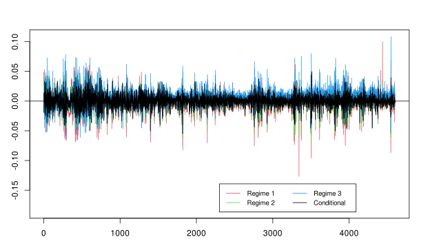  

***
***Biểu đồ residuals theo từng regime***  
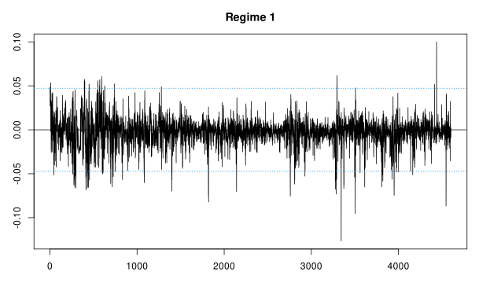  
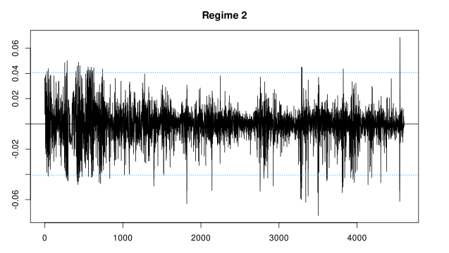  
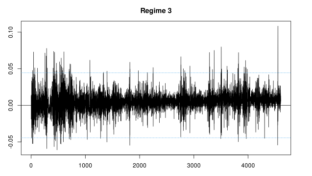  

***
***Biểu đồ Q-Q theo từng regime***  
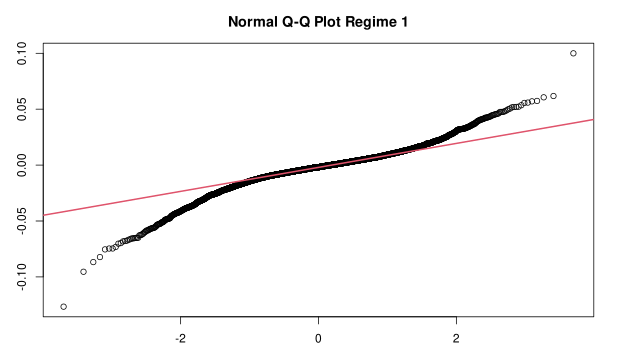  
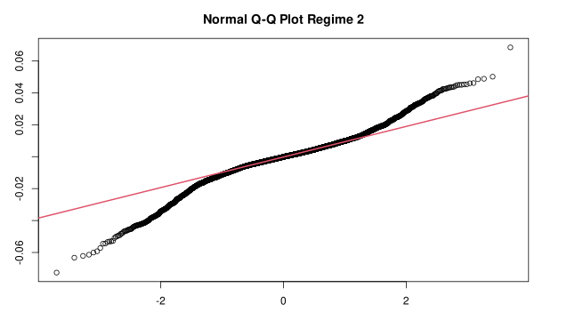  
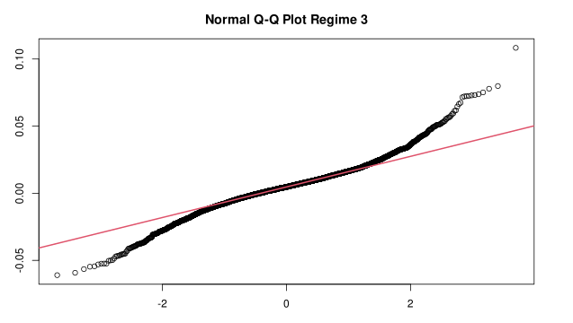  

***
***Biểu đồ ACF, PACF của phần dư và phần dư bình phương***  
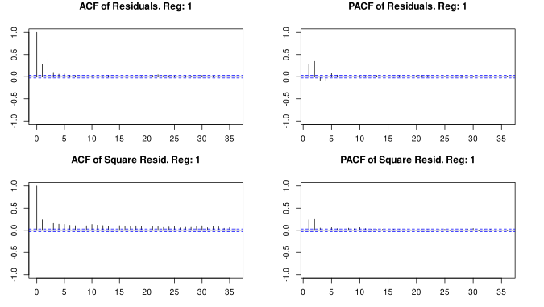  
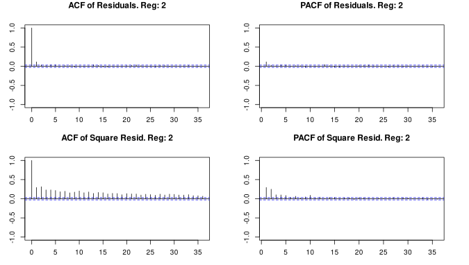  
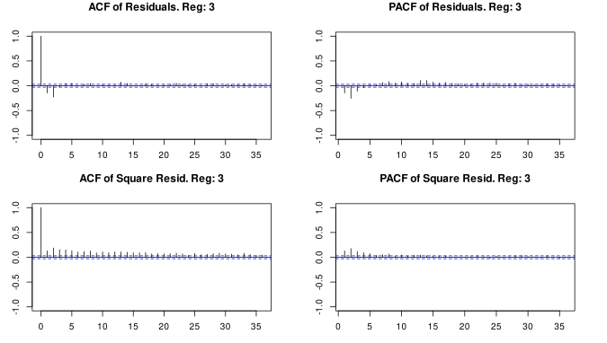  

***
***Biểu đồ xác suất chuyển trạng thái filtered và smoothed theo từng regime***  
  

***
***Biểu đồ gán regime từ mô hình***  
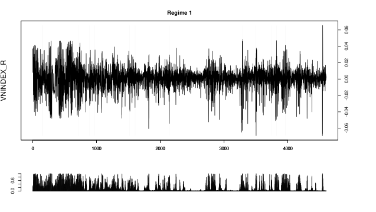  
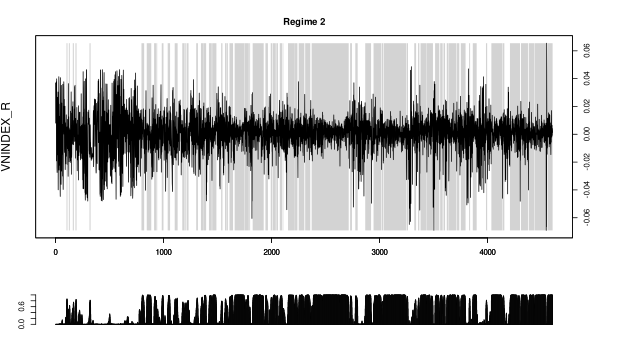  
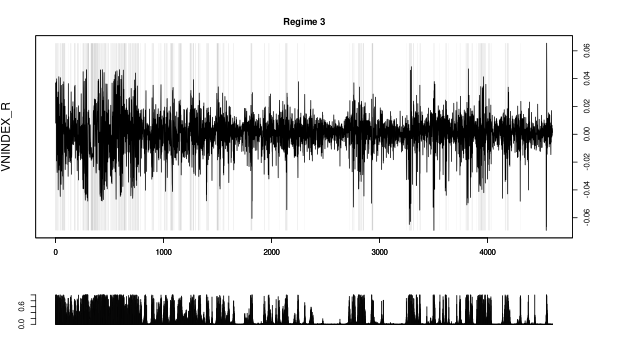  

---
# EGARCH
```r
# =========================================================================

# Kiểm định ARCH effect
ArchTest(df_clean$VNINDEX_R, lags = 5)
```

```
	ARCH LM-test; Null hypothesis: no ARCH effects

data:  df_clean$VNINDEX_R
Chi-squared = 816.75, df = 5, p-value < 2.2e-16
```

---
```r
# GARCH(1,1)
garch <- ugarchspec(
  variance.model = list(model = "sGARCH", garchOrder = c(1, 1)),
  mean.model = list(armaOrder = c(0, 0), include.mean = TRUE),
  distribution.model = "jsu"
)

garch_fit <- ugarchfit(spec = garch, data = df_clean$VNINDEX_R)

show(garch_fit)
```

```
*---------------------------------*
*          GARCH Model Fit        *
*---------------------------------*

Conditional Variance Dynamics 	
-----------------------------------
GARCH Model	: sGARCH(1,1)
Mean Model	: ARFIMA(0,0,0)
Distribution	: jsu 

Optimal Parameters
------------------------------------
        Estimate  Std. Error  t value Pr(>|t|)
mu      0.000420    0.000146   2.8867 0.003893
omega   0.000004    0.000001   2.8569 0.004278
alpha1  0.152247    0.014385  10.5840 0.000000
beta1   0.834483    0.014683  56.8332 0.000000
skew   -0.638705    0.104955  -6.0855 0.000000
shape   2.072851    0.126321  16.4094 0.000000

Robust Standard Errors:
        Estimate  Std. Error  t value Pr(>|t|)
mu      0.000420    0.000168   2.4971 0.012522
omega   0.000004    0.000003   1.0966 0.272815
alpha1  0.152247    0.021500   7.0813 0.000000
beta1   0.834483    0.029027  28.7483 0.000000
skew   -0.638705    0.111362  -5.7354 0.000000
shape   2.072851    0.156512  13.2441 0.000000

LogLikelihood : 14115.35 

Information Criteria
------------------------------------
                    
Akaike       -6.1278
Bayes        -6.1195
Shibata      -6.1278
Hannan-Quinn -6.1249

Weighted Ljung-Box Test on Standardized Residuals
------------------------------------
                        statistic p-value
Lag[1]                      82.56       0
Lag[2*(p+q)+(p+q)-1][2]     85.58       0
Lag[4*(p+q)+(p+q)-1][5]     95.80       0
d.o.f=0
H0 : No serial correlation

Weighted Ljung-Box Test on Standardized Squared Residuals
------------------------------------
                        statistic p-value
Lag[1]                     0.1463  0.7021
Lag[2*(p+q)+(p+q)-1][5]    1.5401  0.7300
Lag[4*(p+q)+(p+q)-1][9]    2.7412  0.8008
d.o.f=2

Weighted ARCH LM Tests
------------------------------------
            Statistic Shape Scale P-Value
ARCH Lag[3]    0.1480 0.500 2.000  0.7004
ARCH Lag[5]    0.3266 1.440 1.667  0.9331
ARCH Lag[7]    0.8725 2.315 1.543  0.9334

Nyblom stability test
------------------------------------
Joint Statistic:  15.9367
Individual Statistics:             
mu     0.4211
omega  1.0149
alpha1 3.2260
beta1  1.9590
skew   2.5895
shape  7.6800

Asymptotic Critical Values (10% 5% 1%)
Joint Statistic:     	 1.49 1.68 2.12
Individual Statistic:	 0.35 0.47 0.75

Sign Bias Test
------------------------------------
                   t-value     prob sig
Sign Bias           2.5587 0.010538  **
Negative Sign Bias  0.7188 0.472317    
Positive Sign Bias  0.8571 0.391409    
Joint Effect       15.3109 0.001569 ***


Adjusted Pearson Goodness-of-Fit Test:
------------------------------------
  group statistic p-value(g-1)
1    20     39.95     0.003325
2    30     50.94     0.007137
3    40     68.54     0.002408
4    50     63.44     0.080537


Elapsed time : 0.7081289 
```

---
```r
# AR(1)-GARCH(1,1)
ar_garch <- ugarchspec(
  variance.model = list(model = "sGARCH", garchOrder = c(1, 1)),
  mean.model = list(armaOrder = c(1, 0), include.mean = TRUE),
  distribution.model = "jsu"
)

ar_garch_fit <- ugarchfit(spec = ar_garch, data = df_clean$VNINDEX_R)

show(ar_garch_fit)
```

```
*---------------------------------*
*          GARCH Model Fit        *
*---------------------------------*

Conditional Variance Dynamics 	
-----------------------------------
GARCH Model	: sGARCH(1,1)
Mean Model	: ARFIMA(1,0,0)
Distribution	: jsu 

Optimal Parameters
------------------------------------
        Estimate  Std. Error  t value Pr(>|t|)
mu      0.000447    0.000159   2.8118 0.004926
ar1     0.105317    0.015571   6.7637 0.000000
omega   0.000004    0.000001   2.9616 0.003061
alpha1  0.159935    0.014671  10.9014 0.000000
beta1   0.825378    0.015224  54.2143 0.000000
skew   -0.608885    0.108881  -5.5922 0.000000
shape   2.135526    0.133939  15.9440 0.000000

Robust Standard Errors:
        Estimate  Std. Error  t value Pr(>|t|)
mu      0.000447    0.000169   2.6478 0.008101
ar1     0.105317    0.019010   5.5401 0.000000
omega   0.000004    0.000003   1.1696 0.242145
alpha1  0.159935    0.020301   7.8781 0.000000
beta1   0.825378    0.029211  28.2557 0.000000
skew   -0.608885    0.113661  -5.3570 0.000000
shape   2.135526    0.170640  12.5148 0.000000

LogLikelihood : 14138.43 

Information Criteria
------------------------------------
                    
Akaike       -6.1374
Bayes        -6.1276
Shibata      -6.1374
Hannan-Quinn -6.1340

Weighted Ljung-Box Test on Standardized Residuals
------------------------------------
                        statistic   p-value
Lag[1]                      10.51 1.187e-03
Lag[2*(p+q)+(p+q)-1][2]     11.43 2.869e-11
Lag[4*(p+q)+(p+q)-1][5]     18.53 1.257e-07
d.o.f=1
H0 : No serial correlation

Weighted Ljung-Box Test on Standardized Squared Residuals
------------------------------------
                        statistic p-value
Lag[1]                     0.4099  0.5220
Lag[2*(p+q)+(p+q)-1][5]    2.4151  0.5241
Lag[4*(p+q)+(p+q)-1][9]    3.8392  0.6162
d.o.f=2

Weighted ARCH LM Tests
------------------------------------
            Statistic Shape Scale P-Value
ARCH Lag[3]    0.3803 0.500 2.000  0.5374
ARCH Lag[5]    0.6563 1.440 1.667  0.8367
ARCH Lag[7]    1.3750 2.315 1.543  0.8461

Nyblom stability test
------------------------------------
Joint Statistic:  16.2959
Individual Statistics:             
mu     0.3156
ar1    4.0523
omega  0.6550
alpha1 3.0489
beta1  1.9734
skew   2.1566
shape  6.9779

Asymptotic Critical Values (10% 5% 1%)
Joint Statistic:     	 1.69 1.9 2.35
Individual Statistic:	 0.35 0.47 0.75

Sign Bias Test
------------------------------------
                   t-value     prob sig
Sign Bias           2.2850 0.022358  **
Negative Sign Bias  0.8634 0.387956    
Positive Sign Bias  1.2084 0.226961    
Joint Effect       14.7395 0.002053 ***


Adjusted Pearson Goodness-of-Fit Test:
------------------------------------
  group statistic p-value(g-1)
1    20     29.54     0.057942
2    30     32.83     0.284623
3    40     54.01     0.055458
4    50     75.21     0.009431


Elapsed time : 0.7872586 
```

---
```r
# AR(1)-GARCH(1,1)-X
ar_garch_x <- ugarchspec(
  variance.model = list(model = "sGARCH", garchOrder = c(1, 1)),
  mean.model = list(
    armaOrder = c(1, 0),
    include.mean = TRUE,
    external.regressors = as.matrix(df_clean[, c("SP500_R", "USDVND_R", "BRENT_R", "LNVOL", "NFI_VOL")])
  ),
  distribution.model = "jsu"
)

ar_garch_x_fit <- ugarchfit(spec = ar_garch_x, data = df_clean$VNINDEX_R)

show(ar_garch_x_fit)
```

```
*---------------------------------*
*          GARCH Model Fit        *
*---------------------------------*

Conditional Variance Dynamics 	
-----------------------------------
GARCH Model	: sGARCH(1,1)
Mean Model	: ARFIMA(1,0,0)
Distribution	: jsu 

Optimal Parameters
------------------------------------
        Estimate  Std. Error  t value Pr(>|t|)
mu      0.000296    0.000164   1.8039 0.071243
ar1     0.093537    0.015957   5.8619 0.000000
mxreg1  0.000336    0.000196   1.7104 0.087198
mxreg2 -0.000238    0.000119  -1.9994 0.045567
mxreg3  0.000329    0.000162   2.0268 0.042679
mxreg4  0.000813    0.000185   4.3848 0.000012
mxreg5  0.001267    0.000162   7.8256 0.000000
omega   0.000004    0.000001   2.9785 0.002897
alpha1  0.166810    0.015329  10.8822 0.000000
beta1   0.819445    0.015764  51.9811 0.000000
skew   -0.556026    0.097297  -5.7148 0.000000
shape   2.053202    0.123182  16.6681 0.000000

Robust Standard Errors:
        Estimate  Std. Error  t value Pr(>|t|)
mu      0.000296    0.000186   1.5914 0.111523
ar1     0.093537    0.019456   4.8075 0.000002
mxreg1  0.000336    0.000231   1.4517 0.146593
mxreg2 -0.000238    0.000084  -2.8405 0.004505
mxreg3  0.000329    0.000194   1.7000 0.089137
mxreg4  0.000813    0.000249   3.2704 0.001074
mxreg5  0.001267    0.000296   4.2815 0.000019
omega   0.000004    0.000003   1.1965 0.231509
alpha1  0.166810    0.021034   7.9303 0.000000
beta1   0.819445    0.030078  27.2444 0.000000
skew   -0.556026    0.101346  -5.4864 0.000000
shape   2.053202    0.147851  13.8870 0.000000

LogLikelihood : 14182.6 

Information Criteria
------------------------------------
                    
Akaike       -6.1544
Bayes        -6.1377
Shibata      -6.1545
Hannan-Quinn -6.1485

Weighted Ljung-Box Test on Standardized Residuals
------------------------------------
                        statistic   p-value
Lag[1]                      12.45 4.179e-04
Lag[2*(p+q)+(p+q)-1][2]     12.93 4.919e-13
Lag[4*(p+q)+(p+q)-1][5]     18.06 2.109e-07
d.o.f=1
H0 : No serial correlation

Weighted Ljung-Box Test on Standardized Squared Residuals
------------------------------------
                        statistic p-value
Lag[1]                     0.6427  0.4227
Lag[2*(p+q)+(p+q)-1][5]    4.3770  0.2106
Lag[4*(p+q)+(p+q)-1][9]    6.2767  0.2676
d.o.f=2

Weighted ARCH LM Tests
------------------------------------
            Statistic Shape Scale P-Value
ARCH Lag[3]    0.7395 0.500 2.000  0.3898
ARCH Lag[5]    0.9968 1.440 1.667  0.7339
ARCH Lag[7]    1.7595 2.315 1.543  0.7680

Nyblom stability test
------------------------------------
Joint Statistic:  17.3876
Individual Statistics:              
mu     0.07801
ar1    3.05635
mxreg1 0.95250
mxreg2 0.16426
mxreg3 0.14487
mxreg4 0.34165
mxreg5 0.07030
omega  0.60677
alpha1 3.81465
beta1  2.62026
skew   1.50227
shape  7.40806

Asymptotic Critical Values (10% 5% 1%)
Joint Statistic:     	 2.69 2.96 3.51
Individual Statistic:	 0.35 0.47 0.75

Sign Bias Test
------------------------------------
                   t-value      prob sig
Sign Bias           2.2815 0.0225657  **
Negative Sign Bias  0.9318 0.3514972    
Positive Sign Bias  1.4818 0.1384691    
Joint Effect       16.3509 0.0009608 ***


Adjusted Pearson Goodness-of-Fit Test:
------------------------------------
  group statistic p-value(g-1)
1    20     24.61       0.1739
2    30     37.79       0.1270
3    40     39.46       0.4495
4    50     54.55       0.2716


Elapsed time : 1.541786 
```

---
```r
# AR(1)-EGARCH(1,1)-X
ar_egarch_x <- ugarchspec(
  variance.model = list(model = "eGARCH", garchOrder = c(1, 1)),
  mean.model = list(
    armaOrder = c(1, 0),
    include.mean = TRUE,
    external.regressors = as.matrix(df_clean[, c("SP500_R", "USDVND_R", "BRENT_R", "LNVOL", "NFI_VOL")])
  ),
  distribution.model = "jsu"
)

ar_egarch_x_fit <- ugarchfit(spec = ar_egarch_x, data = df_clean$VNINDEX_R)

show(ar_egarch_x_fit)
```

```
*---------------------------------*
*          GARCH Model Fit        *
*---------------------------------*

Conditional Variance Dynamics 	
-----------------------------------
GARCH Model	: eGARCH(1,1)
Mean Model	: ARFIMA(1,0,0)
Distribution	: jsu 

Optimal Parameters
------------------------------------
        Estimate  Std. Error   t value Pr(>|t|)
mu      0.000188    0.000189   0.99403 0.320209
ar1     0.101476    0.014868   6.82494 0.000000
mxreg1  0.000300    0.000158   1.90257 0.057096
mxreg2 -0.000187    0.000109  -1.70941 0.087375
mxreg3  0.000319    0.000151   2.10959 0.034894
mxreg4  0.000792    0.000255   3.10536 0.001900
mxreg5  0.001338    0.000156   8.54881 0.000000
omega  -0.303391    0.036406  -8.33354 0.000000
alpha1 -0.053573    0.010596  -5.05576 0.000000
beta1   0.966257    0.004051 238.52411 0.000000
gamma1  0.290667    0.019854  14.64024 0.000000
skew   -0.530908    0.095873  -5.53761 0.000000
shape   2.074744    0.126534  16.39676 0.000000

Robust Standard Errors:
        Estimate  Std. Error   t value Pr(>|t|)
mu      0.000188    0.000325   0.57971 0.562112
ar1     0.101476    0.016772   6.05016 0.000000
mxreg1  0.000300    0.000162   1.85554 0.063519
mxreg2 -0.000187    0.000078  -2.39206 0.016754
mxreg3  0.000319    0.000178   1.78974 0.073497
mxreg4  0.000792    0.000492   1.60956 0.107495
mxreg5  0.001338    0.000262   5.10275 0.000000
omega  -0.303391    0.033321  -9.10499 0.000000
alpha1 -0.053573    0.012233  -4.37948 0.000012
beta1   0.966257    0.003713 260.25451 0.000000
gamma1  0.290667    0.019989  14.54163 0.000000
skew   -0.530908    0.102400  -5.18467 0.000000
shape   2.074744    0.151591  13.68648 0.000000

LogLikelihood : 14203.38 

Information Criteria
------------------------------------
                    
Akaike       -6.1630
Bayes        -6.1449
Shibata      -6.1630
Hannan-Quinn -6.1566

Weighted Ljung-Box Test on Standardized Residuals
------------------------------------
                        statistic   p-value
Lag[1]                      9.599 1.947e-03
Lag[2*(p+q)+(p+q)-1][2]    10.113 9.912e-10
Lag[4*(p+q)+(p+q)-1][5]    15.086 5.454e-06
d.o.f=1
H0 : No serial correlation

Weighted Ljung-Box Test on Standardized Squared Residuals
------------------------------------
                        statistic p-value
Lag[1]                     0.5454  0.4602
Lag[2*(p+q)+(p+q)-1][5]    4.9402  0.1579
Lag[4*(p+q)+(p+q)-1][9]    6.7834  0.2180
d.o.f=2

Weighted ARCH LM Tests
------------------------------------
            Statistic Shape Scale P-Value
ARCH Lag[3]    0.4248 0.500 2.000  0.5146
ARCH Lag[5]    0.7311 1.440 1.667  0.8140
ARCH Lag[7]    1.3985 2.315 1.543  0.8415

Nyblom stability test
------------------------------------
Joint Statistic:  15.6279
Individual Statistics:              
mu     0.07781
ar1    3.30913
mxreg1 0.88033
mxreg2 0.18030
mxreg3 0.12921
mxreg4 0.25797
mxreg5 0.05909
omega  2.37867
alpha1 2.32915
beta1  2.06974
gamma1 0.90985
skew   1.96768
shape  5.89988

Asymptotic Critical Values (10% 5% 1%)
Joint Statistic:     	 2.89 3.15 3.69
Individual Statistic:	 0.35 0.47 0.75

Sign Bias Test
------------------------------------
                   t-value    prob sig
Sign Bias           2.2085 0.02726  **
Negative Sign Bias  1.4894 0.13644    
Positive Sign Bias  0.8519 0.39430    
Joint Effect       10.1852 0.01706  **


Adjusted Pearson Goodness-of-Fit Test:
------------------------------------
  group statistic p-value(g-1)
1    20     15.86       0.6666
2    30     29.42       0.4435
3    40     28.86       0.8828
4    50     47.13       0.5493


Elapsed time : 2.356594 
```

---
```r
# AR(1)-GJR-GARCH(1,1)-X
ar_gjr_garch_x <- ugarchspec(
  variance.model = list(model = "gjrGARCH", garchOrder = c(1, 1)),
  mean.model = list(
    armaOrder = c(1, 0),
    include.mean = TRUE,
    external.regressors = as.matrix(df_clean[, c("SP500_R", "USDVND_R", "BRENT_R", "LNVOL", "NFI_VOL")])
  ),
  distribution.model = "jsu"
)

ar_gjr_garch_x_fit <- ugarchfit(spec = ar_gjr_garch_x, data = df_clean$VNINDEX_R)

show(ar_gjr_garch_x_fit)
```

```
*---------------------------------*
*          GARCH Model Fit        *
*---------------------------------*

Conditional Variance Dynamics 	
-----------------------------------
GARCH Model	: gjrGARCH(1,1)
Mean Model	: ARFIMA(1,0,0)
Distribution	: jsu 

Optimal Parameters
------------------------------------
        Estimate  Std. Error  t value Pr(>|t|)
mu      0.000205    0.000167   1.2238 0.221035
ar1     0.104888    0.016430   6.3838 0.000000
mxreg1  0.000319    0.000196   1.6263 0.103889
mxreg2 -0.000233    0.000118  -1.9813 0.047557
mxreg3  0.000321    0.000163   1.9716 0.048655
mxreg4  0.000743    0.000186   4.0017 0.000063
mxreg5  0.001291    0.000162   7.9640 0.000000
omega   0.000005    0.000001   3.0561 0.002242
alpha1  0.132592    0.015181   8.7339 0.000000
beta1   0.809917    0.016101  50.3029 0.000000
gamma1  0.079406    0.022684   3.5005 0.000464
skew   -0.521726    0.094115  -5.5435 0.000000
shape   2.045979    0.123597  16.5537 0.000000

Robust Standard Errors:
        Estimate  Std. Error  t value Pr(>|t|)
mu      0.000205    0.000197   1.0380 0.299267
ar1     0.104888    0.020073   5.2254 0.000000
mxreg1  0.000319    0.000231   1.3803 0.167496
mxreg2 -0.000233    0.000081  -2.8841 0.003925
mxreg3  0.000321    0.000194   1.6511 0.098716
mxreg4  0.000743    0.000249   2.9897 0.002792
mxreg5  0.001291    0.000283   4.5652 0.000005
omega   0.000005    0.000004   1.1648 0.244106
alpha1  0.132592    0.016410   8.0801 0.000000
beta1   0.809917    0.031545  25.6748 0.000000
gamma1  0.079406    0.033769   2.3514 0.018702
skew   -0.521726    0.101053  -5.1629 0.000000
shape   2.045979    0.153863  13.2974 0.000000

LogLikelihood : 14190.23 

Information Criteria
------------------------------------
                    
Akaike       -6.1573
Bayes        -6.1392
Shibata      -6.1573
Hannan-Quinn -6.1509

Weighted Ljung-Box Test on Standardized Residuals
------------------------------------
                        statistic   p-value
Lag[1]                      10.40 1.261e-03
Lag[2*(p+q)+(p+q)-1][2]     10.80 1.598e-10
Lag[4*(p+q)+(p+q)-1][5]     16.19 1.646e-06
d.o.f=1
H0 : No serial correlation

Weighted Ljung-Box Test on Standardized Squared Residuals
------------------------------------
                        statistic p-value
Lag[1]                      1.486  0.2228
Lag[2*(p+q)+(p+q)-1][5]     3.961  0.2590
Lag[4*(p+q)+(p+q)-1][9]     5.789  0.3232
d.o.f=2

Weighted ARCH LM Tests
------------------------------------
            Statistic Shape Scale P-Value
ARCH Lag[3]     1.195 0.500 2.000  0.2742
ARCH Lag[5]     1.664 1.440 1.667  0.5502
ARCH Lag[7]     2.334 2.315 1.543  0.6469

Nyblom stability test
------------------------------------
Joint Statistic:  16.5411
Individual Statistics:              
mu     0.06873
ar1    3.03198
mxreg1 0.99821
mxreg2 0.18489
mxreg3 0.14301
mxreg4 0.26557
mxreg5 0.06494
omega  0.77321
alpha1 5.38019
beta1  3.34711
gamma1 2.26338
skew   2.13905
shape  8.24076

Asymptotic Critical Values (10% 5% 1%)
Joint Statistic:     	 2.89 3.15 3.69
Individual Statistic:	 0.35 0.47 0.75

Sign Bias Test
------------------------------------
                   t-value    prob sig
Sign Bias            2.357 0.01844  **
Negative Sign Bias   1.853 0.06392   *
Positive Sign Bias   1.094 0.27416    
Joint Effect        12.568 0.00567 ***


Adjusted Pearson Goodness-of-Fit Test:
------------------------------------
  group statistic p-value(g-1)
1    20     21.07       0.3329
2    30     35.42       0.1910
3    40     34.28       0.6849
4    50     49.95       0.4354


Elapsed time : 2.20274 
```

---
```r
model_summary <- function(model) {
  c(
    AIC = infocriteria(model)[1],
    BIC = infocriteria(model)[2],
    logLik = likelihood(model)
  )
}

garch_results <- rbind(
  "GARCH(1,1)" = model_summary(garch_fit),
  "AR(1)-GARCH(1,1)" = model_summary(ar_garch_fit),
  "AR(1)-GARCH(1,1)-X" = model_summary(ar_garch_x_fit),
  "AR(1)-EGARCH(1,1)-X" = model_summary(ar_egarch_x_fit),
  "AR(1)-GJR-GARCH(1,1)-X" = model_summary(ar_gjr_garch_x_fit)
)

garch_results <- as.data.frame(garch_results)
garch_results <- arrange(garch_results, AIC, BIC, desc(logLik))
print(garch_results)
cat("Best-fit model:", rownames(garch_results)[1])
```

```
                             AIC       BIC   logLik
AR(1)-EGARCH(1,1)-X    -6.163031 -6.144865 14203.38
AR(1)-GJR-GARCH(1,1)-X -6.157322 -6.139156 14190.23
AR(1)-GARCH(1,1)-X     -6.154440 -6.137671 14182.60
AR(1)-GARCH(1,1)       -6.137428 -6.127647 14138.43
GARCH(1,1)             -6.127838 -6.119454 14115.35

Best-fit model: AR(1)-EGARCH(1,1)-X
```

---
```r
## Plot
par(mfrow = c(1, 1))
plot(
  df_clean$DATE,
  sigma(ar_egarch_x_fit),
  type = "l",
  col = "palegreen3",
  main = "Conditional Volatility (EGARCH)",
  xlab = "Date",
  ylab = ""
)
plot(
  df_clean$DATE,
  residuals(ar_egarch_x_fit, standardize = TRUE),
  type = "l",
  col = "palegreen3",
  main = "Standardized Residuals",
  xlab = "Date",
  ylab = ""
)
qqnorm(residuals(ar_egarch_x_fit, standardize = TRUE))
qqline(residuals(ar_egarch_x_fit, standardize = TRUE), col = "red")
hist(
  residuals(ar_egarch_x_fit, standardize = TRUE),
  breaks = 50,
  main = "Histogram of Standardized Residuals",
  probability = TRUE,
  xlab = ""
)

ni <- newsimpact(ar_egarch_x_fit)
ni_df <- data.frame(z = ni$zx, h = ni$zy)
ggplot(ni_df, aes(x = z, y = h)) +
  geom_line(color = "palegreen3", size = 1.2) +
  geom_vline(
    xintercept = 0,
    linetype = "dashed",
    color = "gray50"
  ) +
  labs(title = "News Impact Curve – AR(1)-EGARCH(1,1)-X", x = "Shock", y = "Conditional Variance") +
  theme_minimal(base_size = 14)
```

***Biểu đồ chuỗi độ biến động có điều kiện (conditional volatility)***  
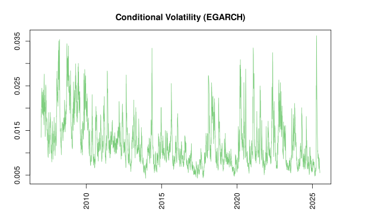  

***
***Biểu đồ phần dư chuẩn hoá (standardized residuals)***  
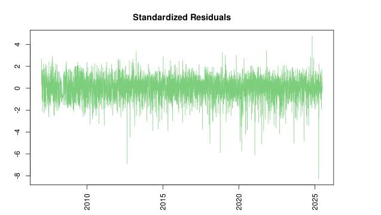  

***
***Biểu đồ Q-Q của phần dư chuẩn hóa***  
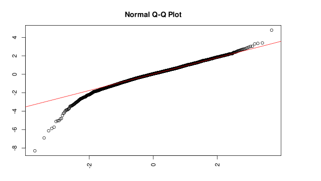  

***
***Biểu đồ histogram của phần dư chuẩn hóa***  
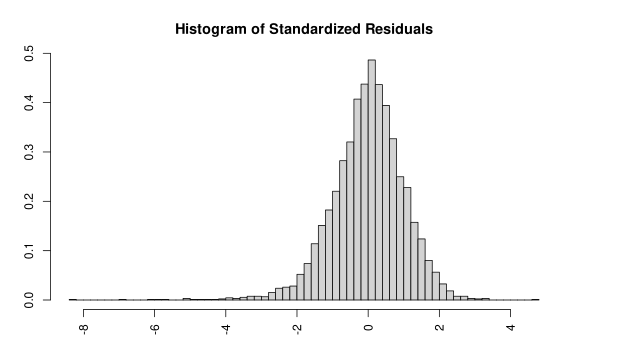  

***
***Đường cong tác động thông tin (News Impact Curve)***  
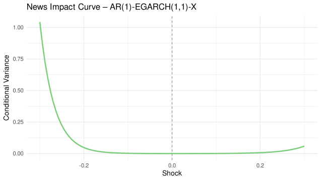  

---
# QUANTILE REGRESSION
```r
# =========================================================================

# Kiểm định phương sai thay đổi (Heteroskedasticity)
ols_model <- lm(VNINDEX_R ~ SP500_R + USDVND_R + BRENT_R + LNVOL + NFI_VOL, data = df_clean)
bptest(ols_model)
```

```
	studentized Breusch-Pagan test

data:  ols_model
BP = 123.45, df = 5, p-value < 2.2e-16
```

---
```r
# Hồi quy Phân vị
taus <- c(0.1, 0.25, 0.5, 0.75, 0.9)
qr_models <- lapply(taus, function(tau) {
  rq(
    VNINDEX_R ~ SP500_R + USDVND_R + BRENT_R + LNVOL + NFI_VOL,
    data = df_clean,
    tau = tau
  )
})
for (i in seq_along(taus)) {
  cat("\n\n--- Quantile:", taus[i], "---\n")
  print(summary(qr_models[[i]], se = "boot"))
}
```

```
--- Quantile: 0.1 ---

Call: rq(formula = VNINDEX_R ~ SP500_R + USDVND_R + BRENT_R + LNVOL + 
    NFI_VOL, tau = tau, data = df_clean)

tau: [1] 0.1

Coefficients:
            Value     Std. Error t value   Pr(>|t|) 
(Intercept)  -0.01499   0.00049  -30.70946   0.00000
SP500_R       0.00035   0.00047    0.75305   0.45146
USDVND_R     -0.00045   0.00038   -1.18075   0.23776
BRENT_R       0.00181   0.00040    4.49583   0.00001
LNVOL         0.00318   0.00053    5.98626   0.00000
NFI_VOL       0.00053   0.00066    0.80158   0.42284


--- Quantile: 0.25 ---

Call: rq(formula = VNINDEX_R ~ SP500_R + USDVND_R + BRENT_R + LNVOL + 
    NFI_VOL, tau = tau, data = df_clean)

tau: [1] 0.25

Coefficients:
            Value     Std. Error t value   Pr(>|t|) 
(Intercept)  -0.00618   0.00026  -23.45590   0.00000
SP500_R       0.00058   0.00037    1.57399   0.11556
USDVND_R      0.00003   0.00025    0.10679   0.91496
BRENT_R       0.00103   0.00036    2.86281   0.00422
LNVOL         0.00277   0.00028   10.05541   0.00000
NFI_VOL       0.00130   0.00027    4.86286   0.00000


--- Quantile: 0.5 ---

Call: rq(formula = VNINDEX_R ~ SP500_R + USDVND_R + BRENT_R + LNVOL + 
    NFI_VOL, tau = tau, data = df_clean)

tau: [1] 0.5

Coefficients:
            Value    Std. Error t value  Pr(>|t|)
(Intercept)  0.00077  0.00019    4.18365  0.00003
SP500_R      0.00027  0.00031    0.87116  0.38371
USDVND_R    -0.00016  0.00026   -0.59840  0.54960
BRENT_R      0.00043  0.00019    2.22952  0.02583
LNVOL        0.00106  0.00023    4.57642  0.00000
NFI_VOL      0.00138  0.00024    5.84560  0.00000


--- Quantile: 0.75 ---

Call: rq(formula = VNINDEX_R ~ SP500_R + USDVND_R + BRENT_R + LNVOL + 
    NFI_VOL, tau = tau, data = df_clean)

tau: [1] 0.75

Coefficients:
            Value    Std. Error t value  Pr(>|t|)
(Intercept)  0.00726  0.00020   36.31019  0.00000
SP500_R      0.00042  0.00034    1.24722  0.21238
USDVND_R    -0.00019  0.00026   -0.72175  0.47048
BRENT_R      0.00034  0.00033    1.01275  0.31123
LNVOL       -0.00074  0.00028   -2.67548  0.00749
NFI_VOL      0.00148  0.00037    4.02612  0.00006


--- Quantile: 0.9 ---

Call: rq(formula = VNINDEX_R ~ SP500_R + USDVND_R + BRENT_R + LNVOL + 
    NFI_VOL, tau = tau, data = df_clean)

tau: [1] 0.9

Coefficients:
            Value    Std. Error t value  Pr(>|t|)
(Intercept)  0.01497  0.00037   40.51399  0.00000
SP500_R      0.00041  0.00039    1.05139  0.29313
USDVND_R    -0.00037  0.00034   -1.09299  0.27446
BRENT_R      0.00055  0.00039    1.38392  0.16645
LNVOL       -0.00264  0.00039   -6.80764  0.00000
NFI_VOL      0.00147  0.00040    3.63738  0.00028
```

---
```r
# Plot
coef_data <- do.call(rbind, lapply(seq_along(taus), function(i) {
  cbind(tau = taus[i], as.data.frame(t(coef(qr_models[[i]]))))
}))

coef_melted <- melt(coef_data, id.vars = "tau")

variable_order <- c(
  "(Intercept)",
  "SP500_R",
  "USDVND_R",
  "BRENT_R",
  "LNVOL",
  "NFI_VOL"
)
coef_melted$variable <- factor(coef_melted$variable, levels = variable_order)

custom_colors <- brewer.pal(6, "Set2")

ggplot(
  coef_melted,
  aes(
    x = tau,
    y = value,
    color = variable,
    group = variable
  )
) +
  geom_hline(
    yintercept = 0,
    color = "gray50",
    linetype = "dashed",
    size = 0.6
  ) +
  geom_line(size = 1) +
  geom_point(
    size = 2,
    shape = 21,
    fill = "white",
    stroke = 1
  ) +
  scale_color_manual(values = custom_colors) +
  scale_x_continuous(
    breaks = unique(coef_melted$tau),
    labels = function(x) {
      paste0(x * 100, "%")
    }
  ) +
  scale_y_continuous(breaks = pretty_breaks(n = 8)) +
  labs(
    title = "Quantile Regression Coefficients",
    x = "Quantile (τ)",
    y = "Coefficient Value",
    color = "Variable"
  ) +
  theme_minimal(base_size = 14) +
  theme(
    panel.grid.minor = element_blank(),
    panel.grid.major = element_line(color = "gray92"),
    axis.line = element_line(color = "gray30", size = 0.6),
    plot.title = element_text(face = "bold", size = 18, hjust = 0.5),
    plot.subtitle = element_text(
      face = "italic",
      size = 12,
      hjust = 0.5,
      margin = margin(b = 15)
    ),
    legend.position = "bottom",
    legend.background = element_rect(fill = "white", color = "gray90"),
    legend.margin = margin(
      t = 0,
      r = 5,
      b = 0,
      l = 5
    ),
    legend.key.size = unit(1.2, "cm"),
    legend.title = element_text(face = "bold"),
    axis.title = element_text(face = "bold", margin = margin(
      t = 10,
      r = 10,
      b = 10,
      l = 10
    )),
    plot.background = element_rect(fill = "white", color = NA),
    panel.border = element_rect(
      color = "gray80",
      fill = NA,
      size = 0.6
    )
  )

plot_list <- list()
for (i in seq_along(taus)) {
  p <- ggplot(data.frame(residuals = resid(qr_models[[i]])), aes(x = residuals)) +
    geom_density(
      fill = "palegreen3",
      alpha = 0.7,
      color = "black"
    ) +
    labs(
      title = paste("τ =", taus[i]),
      x = "Residuals",
      y = "Density"
    ) +
    theme_minimal(base_size = 12) +
    theme(plot.title = element_text(hjust = 0.5, face = "bold"))
  
  plot_list[[i]] <- p
}
title <- grid::textGrob(
  "Distribution of Residuals Across Quantiles",
  gp = grid::gpar(fontface = "bold", fontsize = 16)
)
combined_plot <- grid.arrange(grobs = plot_list, ncol = 2, top = title)
print(combined_plot)
```

***Biểu đồ hệ số hồi quy theo từng phân vị***  
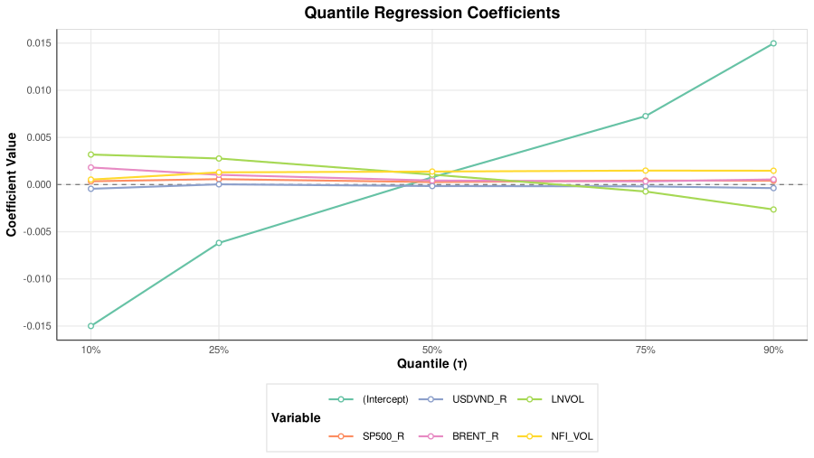  

***
***Biểu đồ phân phối phần dư tại các phân vị***  
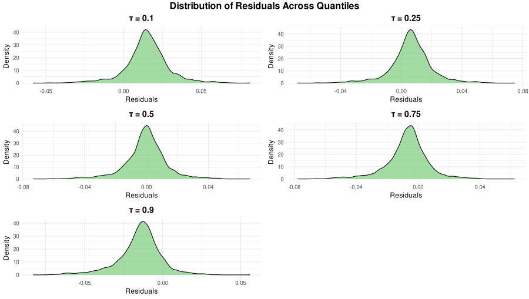  